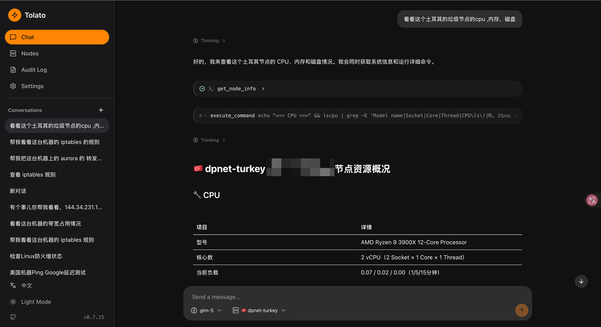
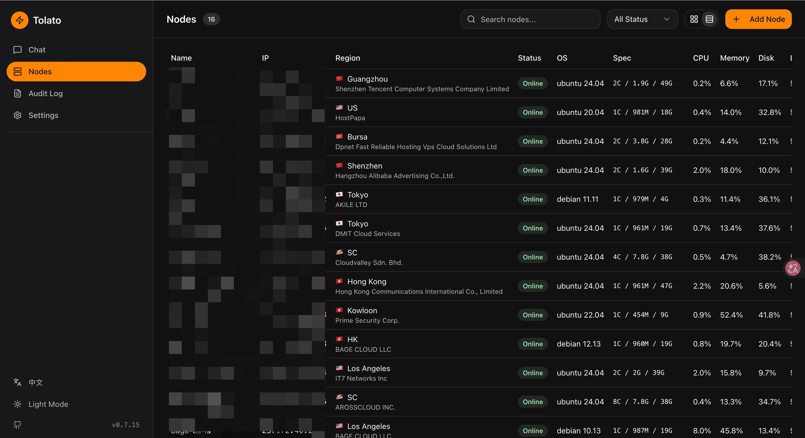
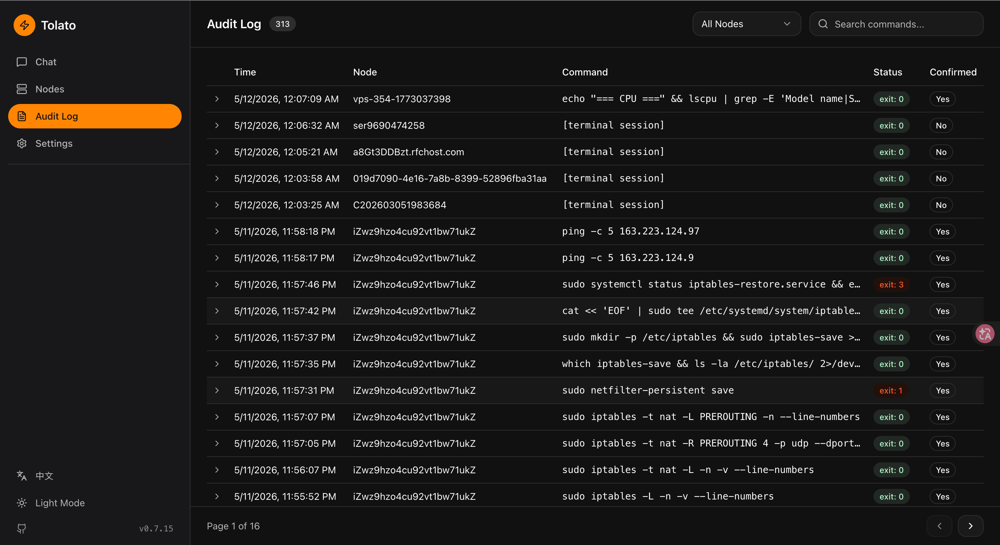
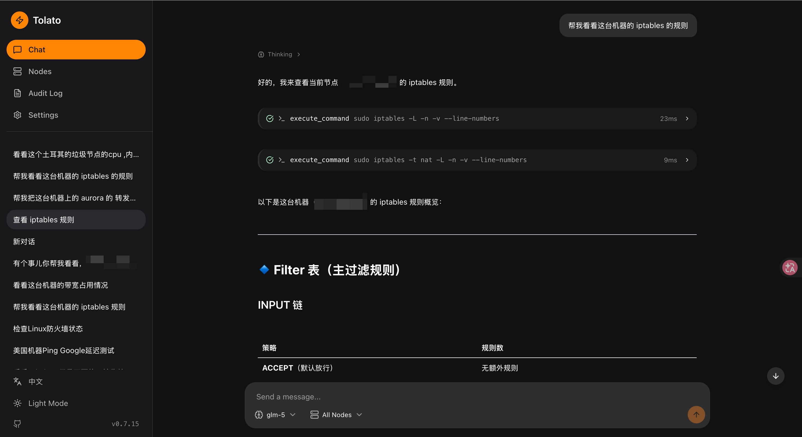
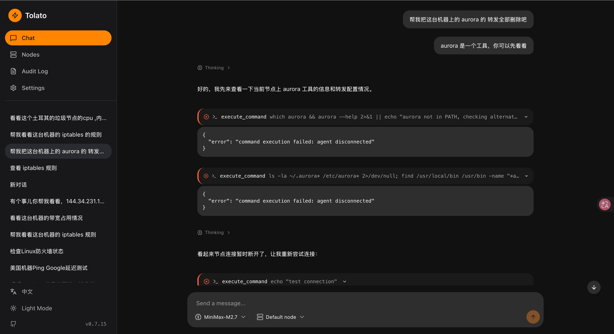

# Tolato
> English · [简体中文](README.zh-CN.md)

Natural-language server management. Talk to a chat UI; it drives remote nodes through an agent that executes commands, collects metrics, and probes network links.

## Screenshots



| Nodes inventory | Audit log |
|---|---|
|  |  |
|  |  |

## Architecture

```
┌──────────┐    WebSocket     ┌──────────┐    WebSocket    ┌──────────┐
│   web    │ ◄──────────────► │  server  │ ◄─────────────► │  agent   │
│ (Vue 3)  │   /ws/chat       │   (Go)   │   /ws/agent     │   (Go)   │
└──────────┘                  └────┬─────┘                 └──────────┘
                                   │                            nodes
                                   ▼
                              ┌─────────┐
                              │Postgres │
                              └─────────┘
                                   ▲
                                   │   LLM (OpenAI-compatible)
                                   ▼
                              Chat loop + tool calls
```

- **server/** — Gin HTTP + WebSocket, GORM/Postgres, LLM chat loop, tool executor, session manager, probe/alert engine, Telegram notifier, JWT + API-key auth.
- **agent/** — Binary running on managed nodes. Command executor, system metrics collector, ICMP/TCP/bandwidth probes. Registers via one-time token; persistent identity in `~/.tolato`.
- **web/** — Vue 3 + Vite + shadcn-vue. Chat, nodes, audit log, settings, topology monitor, alerts.
- **docs/** — Design, loop architecture, frontend architecture, nodeprobe, implementation plan.

## Deploy (docker-compose)

The included [docker-compose.yaml](docker-compose.yaml) runs the server image from GHCR plus a Postgres container. The web UI is embedded in the server binary, so there's nothing else to run.

Requirements: Docker with Compose v2.

### One-line install

```sh
curl -fsSL https://raw.githubusercontent.com/momaek/tolato/main/scripts/install-server.sh | bash
```

Downloads `docker-compose.yaml` + `config.example.yaml` into `./tolato/`, generates random `encrypt_key` / `jwt_secret` / admin password, and runs `docker compose up -d`. Prints the login credentials at the end — **save them, they aren't shown again.**

Flags: `--dir <path>` target directory, `--port <port>` host port (default `8080`), `--admin-user <name>` (default `admin`). Env: `TOLATO_VERSION=v0.1.0` pins the image tag.

### Manual

```sh
# 1. Create the runtime config from the sample.
cp config.example.yaml config.yaml

# 2. Edit config.yaml — change every `CHANGE ME` marker:
#      security.encrypt_key   (32 bytes, encrypts secrets at rest)
#      security.jwt_secret    (signs session tokens)
#      auth.username / auth.password  (web UI login)
#    and set:
#      server.public_address  (your public URL, e.g. https://tolato.example.com)
#      server.allowed_origins (same URL, for CORS + WS origin check)

# 3. Start.
docker compose up -d
```

Open `http://localhost:8080` and log in with the `auth` credentials.

**Version pinning.** The compose file uses `${TOLATO_VERSION:-latest}`. For reproducible deploys pin to a release tag:

```sh
TOLATO_VERSION=v0.1.0 docker compose up -d
```

**Upgrade.**

```sh
docker compose pull server && docker compose up -d
```

Schema migrations run automatically on startup.

**Behind a reverse proxy** (Caddy / Nginx / Traefik): terminate TLS upstream, forward `/` to the server container on port 8080, and make sure WebSocket upgrades are preserved. Set `server.public_address` to the proxied URL so the agent install command and WebSocket URL are generated correctly.

**Postgres credentials.** The defaults in compose and `config.example.yaml` match (`tolato/tolato/tolato`). If you change `POSTGRES_PASSWORD` in the compose file, update `database.dsn` in `config.yaml` to match — the YAML config does not interpolate env vars.

**Agent install.** From the **Nodes** page in the web UI, click *Add Node* to generate a one-time token and the `curl | sudo bash` install command — point it at `server.public_address`.

## Quick start (local dev)

### Prerequisites

- Go 1.23+
- Node.js 20+ and pnpm
- Docker (for Postgres) or an existing Postgres instance

### 1. Database

```sh
docker compose up -d postgres
```

### 2. Server

```sh
cd server
cp config.yaml config.local.yaml   # edit secrets before anything real
go run ./cmd/server -config config.local.yaml
```

Listens on `:8080` by default. See [server/config.yaml](server/config.yaml) for all options.

**Before deploying**: replace `security.encrypt_key`, `security.jwt_secret`, and `auth.password`. Set `server.allowed_origins` for your frontend host.

### 3. Web

```sh
cd web
pnpm install
pnpm dev
```

Dev server at `http://localhost:5173`, proxying API/WS to `:8080`.

### 4. Agent

Generate a registration token from the **Nodes** page in the web UI, then on the target node:

```sh
./agent --server ws://your-server:8080/ws/agent --token <one-time-token>
```

The agent saves its identity to `~/.tolato/` and reconnects using that on subsequent runs — no token needed.

For bandwidth probing, run a file server on the target node:

```sh
./agent serve-testfile --port 9090 --size 10
```

## Configuration

### Server (`server/config.yaml`)

| Section    | Key                                      | Purpose                                         |
|------------|------------------------------------------|-------------------------------------------------|
| `server`   | `host`, `port`, `allowed_origins`        | Bind + CORS/WS origin allowlist                 |
| `database` | `driver`, `dsn`                          | Postgres connection                             |
| `security` | `encrypt_key`, `jwt_secret`, `agent_token_expiry` | Secrets — **must** override defaults     |
| `defaults` | `heartbeat_interval`, `command_timeout`, `max_rounds`, `context_rounds`, `output_truncate_lines` | Chat loop + agent tuning |
| `auth`     | `username`, `password`                   | Bootstrap admin (default: `admin/admin`)        |
| `probe`    | `enabled`, `retention_days`, `telegram`, `alert_rules` | NodeProbe link monitoring            |

LLM endpoint, API key, model, sensitive-command rules, and Telegram bot credentials are stored in the database via the **Settings** UI.

## Development

- Server build: `cd server && go build ./cmd/server`
- Agent build: `cd agent && go build ./cmd/agent`
- Web build: `cd web && pnpm build`
- Branch layout: `main` is the release branch.

## Docs

- [Design overview](docs/design.md)
- [Loop architecture](docs/loop-architecture.md) — chat loop goroutine + channel model
- [Frontend architecture](docs/frontend-architecture.md)
- [NodeProbe](docs/nodeprobe.md) — link monitoring design
- [Implementation plan](docs/implementation-plan.md) — phase-by-phase status
