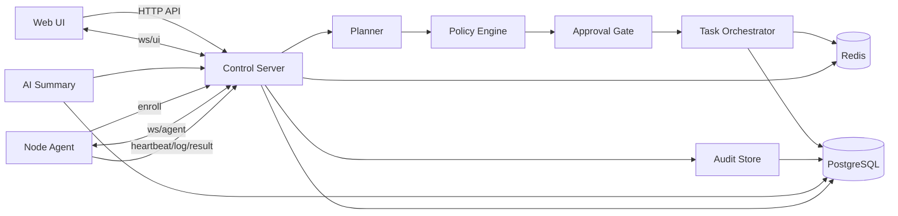
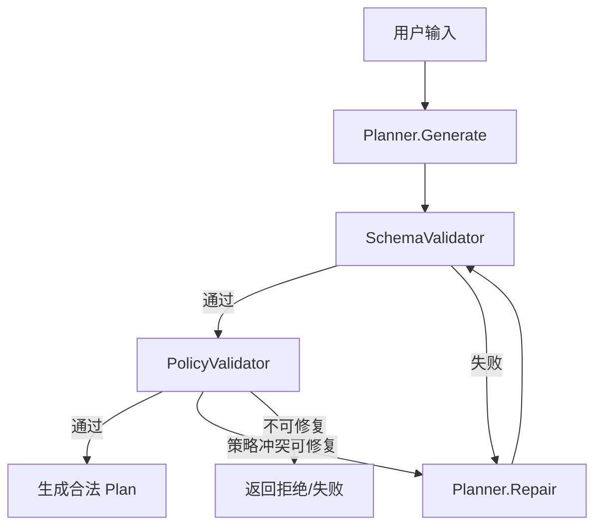

# ToLaTo MVP 后端架构设计

## 1. 文档定位与范围

本文档是 ToLaTo MVP 的后端技术设计说明，目标是把已经确认的后端方案沉淀为一份可直接开工的工程文档。

适用范围：

- Control Server
- Node Agent
- 控制面与节点面的消息协议
- 任务、审批、执行、审计相关的数据模型与状态机

本文档不覆盖：

- 前端 UI 设计细节
- 二期能力，如交互式 shell、文件分发、复杂工作流、多租户权限体系
- 具体 SQL DDL、部署 IaC、CI/CD 脚本

设计基线以 [docs/prd.md](/Users/wentx/momaek/src/tolato/docs/prd.md) 为准，并与 [docs/ui_console_design.md](/Users/wentx/momaek/src/tolato/docs/ui_console_design.md) 保持一致。

---

## 2. 设计原则

### 2.1 核心原则

- 非 ReAct 主链路。Planner 不做 `think -> tool -> observe -> think` 的自治循环。
- 计划与执行分离。AI 只生成结构化计划，不能直接触发真实执行。
- 审批先于执行。所有中高风险任务必须先经过审批再进入队列。
- allowlist action 优先于自由命令。系统围绕受控动作设计，不以任意 shell 为中心。
- PostgreSQL 是事实源。Redis 只承担异步投递、临时状态和事件广播。
- Node Agent 采用显式工程 loop 和状态机，不依赖通用 Agent SDK 驱动核心执行。

### 2.2 为什么不用 ReAct

ToLaTo 的主链路是：

`用户输入 -> 结构化计划 -> 风控校验 -> 审批 -> 执行 -> 聚合 -> 审计`

该链路要求：

- 可预测
- 可审批
- 可审计
- 可回放
- 可失败兜底

ReAct 更适合自治探索和边观察边决策的场景，不适合本项目这种“先审后执行”的受控运维控制台。MVP 中 Planner 只负责一次性生成结构化 `Plan`，最多允许一次 repair，用于修正 schema 或策略冲突，不允许访问真实节点或调用执行工具。

### 2.3 为什么不用通用 Agent SDK 作为核心

MVP 的关键难点不在“智能体推理”，而在：

- 明确的任务状态机
- 明确的审批边界
- 明确的 allowlist action
- 明确的节点连接与执行控制
- 明确的审计事件

通用 Agent SDK 往往会把控制逻辑做成隐式 loop 或工具调用框架，不利于安全约束、排错和审计。因此核心执行链路采用自研显式状态机，必要时仅借用通用中间件能力，不把决策权交给 SDK。

---

## 3. 总体架构

### 3.1 组件视图



### 3.2 两条主链路

#### 控制面链路

`输入 -> 规划 -> 校验 -> 审批 -> 调度 -> 聚合 -> 审计`

- Web UI 提交自然语言任务或受限 manual command
- Control Server 调用 Planner 生成 `PlanDraft`
- SchemaValidator 和 PolicyValidator 完成结构与风控校验
- 低风险只读任务自动通过，其他任务进入审批
- Task Orchestrator 生成父任务和节点级子任务
- 任务落库后投递到 Redis，再由在线 Agent 拉取执行
- 执行结果回写 PostgreSQL，并实时推送给 UI
- 审计事件覆盖计划、审批、执行、取消、超时、总结全链路

#### 节点链路

`连接 -> 接收任务 -> 执行 -> 回传 -> 重连`

- Node Agent 首次 enroll，之后使用持久 secret 建立 `ws/agent`
- Agent 周期 heartbeat，上报基础信息和执行状态
- Agent 接收 `task.dispatch`，先 ack 再进入本地队列
- Action runner 以非 shell 方式执行受控动作
- 执行过程回传 stdout/stderr chunk，最终回传 `task.result`
- 断线自动重连，控制面根据心跳与会话判断在线状态

### 3.3 部署形态

MVP 采用模块化单体：

- 一个 `tolato-server` 进程对外提供 HTTP 和 WebSocket
- 一个 `tolato-agent` 进程运行在每台节点上，由 systemd 托管
- PostgreSQL 作为主存储
- Redis 作为异步和临时态组件

不在 MVP 内拆分微服务。后续如节点规模、审批等待时长或 AI 调用量明显上升，再按边界拆出 `planner` 或 `dispatch`。

---

## 4. Control Server 设计

### 4.1 分层约束

服务端内部按以下调用方向组织：

`transport -> app/usecase -> domain -> infra`

约束：

- `transport` 只负责协议转换、鉴权上下文、参数绑定和错误映射
- `app/usecase` 负责编排事务、状态变更和跨模块协作
- `domain` 只放业务对象、状态机、仓储接口和值对象
- `infra` 实现 PostgreSQL、Redis、LLM、auth、time、id 等适配器
- 禁止 `transport` 直接操作仓储
- 禁止 `plan` 绕过 `policy` 直接入队执行

### 4.2 模块划分

#### `node`

职责：

- 节点注册与 enroll
- heartbeat 接收与在线状态刷新
- 节点基础元信息管理
- WebSocket 会话绑定与断线清理

输入：

- enroll 请求
- heartbeat 消息
- ws 连接事件

输出：

- `Node`
- `NodeSession`
- 节点状态变更事件

依赖：

- `auth`
- PostgreSQL
- Redis

#### `plan`

职责：

- 调用 Planner 生成 `PlanDraft`
- schema 校验
- repair 重试
- target 补全和标准化

输入：

- 用户原始文本
- target
- 节点摘要
- action registry
- 风险策略

输出：

- `Plan`
- 规划错误或不可生成错误

依赖：

- `llm`
- `policy`

#### `policy`

职责：

- action allowlist
- 参数校验
- 风险等级归一化
- 广播限制
- manual command 到 action 的受限解析

输入：

- `PlanDraft`
- action registry
- 节点上下文
- 运行策略

输出：

- 合法 `Plan`
- 拒绝原因

依赖：

- 内置规则

#### `task`

职责：

- 创建父任务和节点级子任务
- 维护 `Task` 与 `TaskExecution` 状态机
- 生成聚合状态

输入：

- 合法 `Plan`
- 审批动作
- 执行结果

输出：

- 任务及其状态变更

依赖：

- PostgreSQL

#### `approval`

职责：

- approve / reject / cancel
- 记录审批人与审批时间
- 维护审批前不可执行约束

输入：

- 审批请求
- 当前任务状态

输出：

- 任务状态更新
- 审计事件

依赖：

- `task`
- `audit`

#### `dispatch`

职责：

- 将父任务拆分为 `TaskExecution`
- 将子任务投递到 Redis
- 处理取消和超时
- 对在线和离线节点做分流

输入：

- 已批准任务
- 在线节点会话

输出：

- Redis 投递事件
- `queued/dispatched/cancelled/timeout` 状态变更

依赖：

- PostgreSQL
- Redis
- `node`

#### `audit`

职责：

- 审计事件落库
- 时间线查询
- 形成不可变事件流

输入：

- 计划创建
- 审批动作
- 执行状态变更
- 执行结果摘要

输出：

- `AuditEvent`

依赖：

- PostgreSQL

#### `summary`

职责：

- 在任务执行后对多节点结果进行总结
- 生成问题归因和建议文案

边界：

- 只做结果解释
- 不参与执行决策
- 不可生成新的真实执行动作

依赖：

- `llm`
- PostgreSQL

### 4.3 关键 use case

推荐至少实现以下 use case：

- `RegisterNode`
- `HeartbeatNode`
- `GenerateTaskPlan`
- `ApproveTask`
- `RejectTask`
- `CancelTask`
- `DispatchApprovedTask`
- `AppendTaskLog`
- `CompleteTaskExecution`
- `SummarizeTaskResult`

---

## 5. Planner 设计

### 5.1 目标

Planner 负责把自然语言或受限 manual command 转换为可校验、可审批、可执行的 `PlanDraft`。

Planner 不负责：

- 调用真实节点工具
- 直接写入执行队列
- 根据实时观察反复自我探索

### 5.2 运行流程



约束：

- 默认 1 次生成
- 最多 1 次 repair
- repair 只基于验证错误修 plan，不访问真实节点，不调用执行工具

### 5.3 输入与输出

#### 输入

- `input_text`
- `mode`
  - `ai_agent`
  - `manual_command`
- `target`
  - 单节点
  - 多节点
  - `all_nodes`
- 节点摘要
  - hostname
  - region
  - os
  - tags
  - online status
- action registry
- 风险与广播策略

#### 输出

`PlanDraft` 最小结构：

```json
{
  "target_nodes": ["sg-prod-01"],
  "summary": "检查 nginx 状态与最近错误日志",
  "estimated_impact": "只读诊断，不修改服务",
  "risk_level": "low",
  "requires_approval": false,
  "steps": [
    {
      "action": "service_status",
      "args": { "service": "nginx" },
      "risk": "low",
      "timeout_sec": 10
    },
    {
      "action": "tail_log",
      "args": { "path": "/var/log/nginx/error.log", "lines": 100 },
      "risk": "low",
      "timeout_sec": 10
    }
  ]
}
```

### 5.4 两个校验器

#### `SchemaValidator`

职责：

- 校验字段是否齐全
- 校验枚举、类型、嵌套结构
- 校验步骤列表不能为空

失败处理：

- 可修复则进入 repair
- 不可修复则返回“无法生成计划”

#### `PolicyValidator`

职责：

- action 是否在 allowlist 中
- args 是否满足参数约束
- 广播写操作是否被禁止
- 日志路径、服务名、网络目标是否在白名单内
- `requires_approval` 和风险等级是否与策略一致

失败处理：

- 可修复的策略冲突进入 repair
- 不可修复则直接拒绝

### 5.5 Planner 接口建议

```go
type Planner interface {
    GeneratePlan(ctx context.Context, in PlanInput) (PlanDraft, error)
    RepairPlan(ctx context.Context, in RepairInput) (PlanDraft, error)
}
```

---

## 6. Node Agent 设计

### 6.1 设计目标

Node Agent 负责：

- 建立和维持到 Control Server 的受控连接
- 接收任务并进入本地调度队列
- 以受控动作执行命令
- 流式回传执行输出与最终结果

Node Agent 不负责：

- 自主规划
- 自主选择执行策略
- 执行任意 shell

### 6.2 四个 loop

#### `connection loop`

职责：

- 首次 enroll
- 建立 `ws/agent`
- 定时 heartbeat
- 断线退避重连

关键行为：

- 启动后读取本地持久身份
- 未注册则调用 enroll
- 已注册则使用 `node_id + secret` 建立 ws
- 断线按指数退避重连，重连成功后恢复 heartbeat

#### `dispatch loop`

职责：

- 接收 `task.dispatch`
- 做参数与版本检查
- 回传 `task.ack`
- 将任务写入本地内存队列

关键行为：

- 对不支持的 action 或非法参数直接 `error`
- 对重复任务做去重
- 对取消中的任务不再入队

#### `execution loop`

职责：

- 从队列中取任务
- 调 action runner
- 处理超时和取消
- 推送 `task.log` 和 `task.result`

关键行为：

- 通过 `exec.CommandContext` 执行固定模板
- 使用 context 控制 timeout
- 逐块读取 stdout/stderr
- 结束后上报 exit code 与 tail

#### `supervisor loop`

职责：

- 限制并发
- 保证写操作串行
- 清理僵尸进程
- 回收执行上下文

关键行为：

- 默认并发 2
- 同一节点写操作默认并发 1
- 进程异常退出时做清理并补发结果

### 6.3 Agent 安全边界

- 不接受裸 shell
- 不经 shell 解释字符串拼接命令
- 每个 action 都做参数校验
- 路径、服务名、网络目标受白名单限制
- 写操作默认串行
- 广播写操作由服务端默认禁止，Agent 仍需二次校验

### 6.4 Agent 对外接口建议

- `POST /api/v1/agent/enroll`
- `GET /ws/agent`

本地运行方式：

- systemd 托管
- 开机自启
- 以最小权限用户运行
- 仅对允许动作使用精确 sudoers

---

## 7. 核心数据模型

以下为业务对象定义，不是完整 SQL DDL。

### 7.1 `Node`

语义：

- 代表被纳管的一台服务器节点

关键字段：

| 字段 | 说明 |
| --- | --- |
| `id` | 节点唯一 ID |
| `hostname` | 节点主机名 |
| `region` | 所在区域 |
| `os` | 操作系统发行版 |
| `version` | Agent 版本 |
| `tags` | 节点标签 |
| `status` | `registering/online/stale/offline` |
| `last_seen_at` | 最近心跳时间 |
| `auth_secret_version` | Agent secret 版本号 |
| `created_at` | 创建时间 |
| `updated_at` | 更新时间 |

生命周期：

- enroll 创建
- heartbeat 持续刷新
- 断线后从 `online` 进入 `stale/offline`

关系：

- 一个 `Node` 可以关联多个 `TaskExecution`
- 一个 `Node` 同时最多有一个活动 `NodeSession`

### 7.2 `NodeSession`

语义：

- 表示某个节点当前在线会话

关键字段：

| 字段 | 说明 |
| --- | --- |
| `node_id` | 对应节点 |
| `session_id` | 当前 ws 会话 ID |
| `connected_at` | 连接建立时间 |
| `last_heartbeat_at` | 最近心跳时间 |
| `agent_pid` | Agent 进程 ID，可选 |
| `remote_addr` | 远端地址 |
| `capabilities` | Agent 声明能力 |
| `status` | `active/closing/closed` |

生命周期：

- ws 建立时创建
- 断线或替换连接时关闭

### 7.3 `Plan`

语义：

- 合法、可审批的结构化执行计划

关键字段：

| 字段 | 说明 |
| --- | --- |
| `target_nodes` | 目标节点列表 |
| `summary` | 计划摘要 |
| `estimated_impact` | 预估影响 |
| `risk_level` | 总体风险等级 |
| `requires_approval` | 是否需要审批 |
| `steps` | 步骤列表 |

生命周期：

- 由 Planner 生成，经校验后固化在任务中

### 7.4 `PlanStep`

语义：

- 计划中的单个可执行步骤

关键字段：

| 字段 | 说明 |
| --- | --- |
| `action` | 动作名 |
| `args` | 动作参数 |
| `risk` | 步骤风险等级 |
| `timeout_sec` | 单步超时 |
| `broadcast_allowed` | 是否允许广播，可由策略填充 |

### 7.5 `Task`

语义：

- 面向用户可见的父任务

关键字段：

| 字段 | 说明 |
| --- | --- |
| `id` | 任务 ID |
| `parent_task_id` | 父任务 ID，父任务可为空；用于后续扩展聚合关系 |
| `mode` | `ai_agent/manual_command` |
| `initiator_id` | 发起人 |
| `target` | 原始目标表达 |
| `input_text` | 原始输入 |
| `plan_json` | 固化后的计划 JSON |
| `risk_level` | 总体风险等级 |
| `approval_status` | `not_required/pending/approved/rejected/cancelled` |
| `final_status` | `planned/waiting_approval/approved/queued/dispatched/running/success/failed/partial_failed/timeout/cancelled` |
| `status_reason` | 状态原因说明 |
| `created_at` | 创建时间 |
| `updated_at` | 更新时间 |

生命周期：

- 从 `planned` 开始
- 经过审批和执行
- 进入终态

关系：

- 一个 `Task` 对应多个 `TaskExecution`
- 一个 `Task` 对应多个 `AuditEvent`

### 7.6 `TaskExecution`

语义：

- 面向节点的子任务执行记录

关键字段：

| 字段 | 说明 |
| --- | --- |
| `id` | 子任务 ID |
| `task_id` | 父任务 ID |
| `node_id` | 目标节点 ID |
| `status` | 子任务状态 |
| `attempt` | 执行尝试次数 |
| `started_at` | 开始时间 |
| `finished_at` | 结束时间 |
| `exit_code` | 退出码 |
| `stdout_tail` | stdout 尾部摘要 |
| `stderr_tail` | stderr 尾部摘要 |
| `status_reason` | 失败、超时、离线等原因 |

生命周期：

- `queued -> dispatched -> running -> terminal`

### 7.7 `AuditEvent`

语义：

- 不可变审计事件

关键字段：

| 字段 | 说明 |
| --- | --- |
| `id` | 事件 ID |
| `task_id` | 所属任务 |
| `actor_id` | 操作者，可为用户或系统 |
| `event_type` | 事件类型 |
| `payload` | 结构化 payload |
| `created_at` | 事件时间 |

建议事件类型：

- `task_planned`
- `task_plan_failed`
- `task_approval_requested`
- `task_approved`
- `task_rejected`
- `task_cancelled`
- `task_dispatched`
- `task_execution_started`
- `task_log_received`
- `task_execution_finished`
- `task_summary_generated`

### 7.8 `ActionSpec`

语义：

- 动作注册表中的单个动作定义

关键字段：

| 字段 | 说明 |
| --- | --- |
| `name` | 动作名 |
| `risk_level` | 默认风险等级 |
| `approval_required` | 是否需要审批 |
| `broadcast_allowed` | 是否允许广播 |
| `timeout_sec` | 默认超时 |
| `arg_schema` | 参数约束 |
| `executor` | 执行器标识 |
| `result_shape` | 结果结构说明 |

---

## 8. 状态机与数据流

### 8.1 节点状态机

```text
registering -> online -> stale -> offline
                   ^         |
                   |---------|
```

规则：

- enroll 后进入 `registering`
- 首次 heartbeat 成功进入 `online`
- 超过心跳阈值未上报进入 `stale`
- 超过离线阈值进入 `offline`
- 恢复 heartbeat 后回到 `online`

建议阈值：

- `stale`: 10 秒无 heartbeat
- `offline`: 30 秒无 heartbeat

### 8.2 任务状态机

```text
planned -> waiting_approval -> approved -> queued -> dispatched -> running -> success
                    |               |           |           |           |
                    |               |           |           |           -> failed
                    |               |           |           |           -> partial_failed
                    |               |           |           |           -> timeout
                    |               |           |           -> cancelled
                    |               |           -> cancelled
                    |               -> rejected
                    -> cancelled
```

规则：

- 低风险只读任务可从 `planned` 直接进入 `approved`
- 未审批任务不得进入 `queued` 或 `running`
- 取消可发生在审批前、排队中或执行中
- 父任务终态由全部 `TaskExecution` 聚合得出
- 多节点场景下存在“部分成功、部分失败”时，父任务状态使用 `partial_failed`

### 8.3 子任务状态机

```text
queued -> dispatched -> running -> success
                             |-> failed
                             |-> timeout
queued -> offline_skipped
queued/dispatched/running -> cancelled
```

### 8.4 主流程一：单节点只读任务

1. Web UI 调 `POST /api/v1/tasks/plan`
2. `plan` 生成 `PlanDraft`
3. `SchemaValidator` 和 `PolicyValidator` 通过
4. `task` 创建父任务，状态为 `planned`
5. 因为是低风险只读任务，自动转为 `approved`
6. `dispatch` 创建单条 `TaskExecution`
7. 先写 PostgreSQL，再写 outbox，再投递 Redis
8. 在线 Agent 收到 `task.dispatch`，回 `task.ack`
9. Agent 执行并流式回传 `task.log`
10. 完成后回 `task.result`
11. `task` 聚合后更新父任务为 `success/failed/timeout`
12. `summary` 生成总结
13. `audit` 写入全链路事件

### 8.5 主流程二：单节点审批任务

1. Web UI 调 `POST /api/v1/tasks/plan`
2. 规划和校验通过
3. `task` 创建父任务，状态为 `waiting_approval`
4. `audit` 记录 `task_approval_requested`
5. 用户调 `POST /api/v1/tasks/:id/approve`
6. `approval` 校验当前状态并写入审批信息
7. 父任务转为 `approved`
8. `dispatch` 创建子任务并投递
9. Agent 执行，结果回传
10. `task` 聚合完成后更新父任务终态
11. `summary` 生成解释
12. `audit` 形成完整审批与执行时间线

### 8.6 主流程三：广播只读任务

1. Web UI 选择 `All nodes` 并生成计划
2. `policy` 确认该 plan 为广播允许的只读动作
3. 父任务自动 `approved`
4. `dispatch` 按在线节点生成多条 `TaskExecution`
5. 对离线节点直接标记 `offline_skipped`
6. 对在线节点逐个投递 `task.dispatch`
7. 多个 Agent 并发执行并回传日志
8. `task` 聚合出 `success/partial_failed/timeout`
9. `summary` 汇总异常节点与建议
10. `audit` 写入广播执行摘要

---

## 9. API 与消息协议

### 9.1 Web API

#### `POST /api/v1/auth/login`

用途：

- 单管理员登录

请求体最小结构：

```json
{
  "username": "admin",
  "password": "******"
}
```

响应最小结构：

```json
{
  "user": {
    "id": "u_admin",
    "role": "admin"
  }
}
```

#### `GET /api/v1/me`

用途：

- 获取当前登录态

#### `GET /api/v1/nodes`

用途：

- 获取节点列表、在线状态和摘要信息

#### `GET /api/v1/nodes/:id`

用途：

- 获取单节点详情

#### `POST /api/v1/tasks/plan`

用途：

- 生成计划并创建任务

请求体最小结构：

```json
{
  "mode": "ai_agent",
  "target": ["sg-prod-01"],
  "input_text": "看看 nginx 状态和最近 100 行错误日志"
}
```

响应最小结构：

```json
{
  "task_id": "task_123",
  "status": "approved",
  "plan": {
    "target_nodes": ["sg-prod-01"],
    "summary": "检查 nginx 状态与错误日志",
    "estimated_impact": "只读诊断，不修改服务",
    "risk_level": "low",
    "requires_approval": false,
    "steps": []
  }
}
```

#### `POST /api/v1/tasks/:id/approve`

用途：

- 审批通过

#### `POST /api/v1/tasks/:id/reject`

用途：

- 审批拒绝

#### `POST /api/v1/tasks/:id/cancel`

用途：

- 取消任务

#### `GET /api/v1/tasks/:id`

用途：

- 获取任务详情、状态、聚合结果、AI 总结

#### `GET /api/v1/tasks/:id/executions`

用途：

- 获取各节点子任务执行明细

#### `GET /api/v1/audits`

用途：

- 按任务或时间范围查询审计事件

### 9.2 WebSocket

#### `GET /ws/ui`

用途：

- 向前端推送节点状态、任务状态、日志流、聚合结果

#### `GET /ws/agent`

用途：

- Agent 与控制面的双向长连接

### 9.3 Agent 消息协议

统一消息包最小结构：

```json
{
  "type": "task.log",
  "task_id": "task_123",
  "node_id": "node_01",
  "seq": 12,
  "timestamp": "2026-03-19T21:00:00Z",
  "payload": {}
}
```

#### `hello`

用途：

- 建连时声明节点身份与能力

`payload` 最小字段：

- `session_id`
- `agent_version`
- `capabilities`

#### `heartbeat`

用途：

- 保持在线状态

`payload` 最小字段：

- `hostname`
- `load`
- `memory`
- `disk`
- `busy`

#### `task.dispatch`

方向：

- server -> agent

`payload` 最小字段：

- `execution_id`
- `steps`
- `timeout_sec`

#### `task.ack`

方向：

- agent -> server

`payload` 最小字段：

- `execution_id`
- `accepted`
- `reason`

#### `task.log`

方向：

- agent -> server

`payload` 最小字段：

- `execution_id`
- `stream`
  - `stdout`
  - `stderr`
- `chunk`

#### `task.result`

方向：

- agent -> server

`payload` 最小字段：

- `execution_id`
- `status`
- `exit_code`
- `stdout_tail`
- `stderr_tail`
- `duration_ms`

#### `task.cancel`

方向：

- server -> agent

`payload` 最小字段：

- `execution_id`
- `reason`

#### `error`

用途：

- 传输层或执行层错误

`payload` 最小字段：

- `code`
- `message`

---

## 10. Action Registry 与执行策略

### 10.1 动作列表

| Action | 参数 | 风险 | 允许广播 | 默认超时 | 结果格式 | 安全限制 |
| --- | --- | --- | --- | --- | --- | --- |
| `system_status` | 无或基础选项 | low | 是 | 10s | CPU/内存/负载摘要 | 只读 |
| `disk_usage` | `path?` | low | 是 | 10s | 文件系统占用列表 | `path` 限定为白名单挂载点 |
| `memory_usage` | 无 | low | 是 | 10s | 内存摘要 | 只读 |
| `docker_ps` | `all?` | low | 是 | 10s | 容器状态列表 | 只读 |
| `service_status` | `service` | low | 是 | 10s | systemd 状态摘要 | `service` 在白名单中 |
| `tail_log` | `path`,`lines` | low | 是 | 15s | 日志文本尾部 | `path` 在白名单中，`lines` 有上限 |
| `restart_service` | `service` | medium | 否 | 30s | 执行结果与 systemd 输出 | `service` 白名单，需审批 |
| `reload_service` | `service` | medium | 否 | 30s | 执行结果与 systemd 输出 | `service` 白名单，需审批 |
| `network_check` | `target`,`port?` | low | 是 | 15s | 连通性结果 | 目标限制为可诊断范围 |

### 10.2 执行模板约束

执行模板使用固定命令映射，例如：

- `service_status(nginx)` -> `systemctl status nginx --no-pager`
- `restart_service(nginx)` -> `sudo systemctl restart nginx`
- `tail_log(/var/log/nginx/error.log, 100)` -> `tail -n 100 /var/log/nginx/error.log`

约束：

- 使用 `exec.CommandContext` 直调程序和参数
- 不使用 `sh -c`
- 所有参数在服务端和 Agent 两侧都校验
- 输出需要进行长度控制和 tail 裁剪

### 10.3 manual command 边界

MVP 中 `manual_command` 不是裸 shell，而是“命令风格输入 -> 受限解析 -> ActionSpec”的别名能力。

示例：

- `systemctl status nginx` -> 可解析成 `service_status`
- `tail -n 100 /var/log/nginx/error.log` -> 可解析成 `tail_log`

不允许：

- 管道
- 重定向
- 下载并执行
- 多命令拼接
- 任意脚本执行

---

## 11. 安全设计

### 11.1 用户侧认证

MVP 只支持单管理员本地账号：

- 用户名密码登录
- 服务端生成 HttpOnly session cookie
- 会话存储在 Redis 或服务端 session store 中

为什么 MVP 不上完整 RBAC：

- 当前产品目标是单管理员审批闭环，不是多租户协作
- RBAC 会显著增加角色矩阵、资源授权、审计归属和 UI 复杂度
- 先完成审批闭环，再扩为多角色模型更稳妥

### 11.2 Agent 侧认证

MVP 采用：

- enrollment token
- 注册后下发持久 secret
- 预留 secret 轮换

流程：

1. 运维在节点首次安装 Agent 时配置 enrollment token
2. Agent 调 `POST /api/v1/agent/enroll`
3. 控制面创建 `Node` 并返回 `node_id + secret`
4. Agent 本地持久化 secret
5. 后续 `ws/agent` 使用 `node_id + secret` 签名认证

为什么先不用完整 mTLS PKI：

- mTLS 证书签发、轮换、吊销和安装链路对 MVP 成本过高
- 当前规模 5-50 台节点，secret 模式可更快落地
- 后续可以在 enroll 基础上升级为证书下发和轮换，不破坏节点标识模型

### 11.3 执行安全

- allowlist action
- 参数验证
- 路径与服务名白名单
- sudoers 最小权限
- 审计事件不可变

明确禁止：

- 裸 shell 透传
- 修改 sudoers
- 修改核心 SSH 配置
- 读取敏感凭证文件
- 下载并执行远程脚本

---

## 12. 存储与一致性

### 12.1 PostgreSQL 与 Redis 分工

#### PostgreSQL

用途：

- 节点元数据
- 任务和子任务事实状态
- 审批状态
- 审计事件
- 查询接口的数据来源

#### Redis

用途：

- 子任务投递队列
- 会话和心跳临时态
- UI 事件广播
- 轻量去重锁和短 TTL 状态

### 12.2 一致性策略

关键规则：

- 先写 PostgreSQL，再发异步事件
- PostgreSQL 是唯一事实源
- Redis 数据丢失后可以依靠 PostgreSQL 重建状态

推荐方案：

- 使用 outbox 模式
- 在同一事务中提交：
  - 任务状态变更
  - 审计事件
  - outbox 记录
- 后台 worker 读取 outbox 并投递 Redis

这样可以避免：

- 数据库已写成功但消息没发出
- 消息已发出但数据库未落库

### 12.3 重启恢复

Control Server 重启后：

- 从 PostgreSQL 读取未终态任务
- 从 Redis 或内存重建 outbox 消费游标
- 以最近 heartbeat 判断节点 `stale/offline`
- 对长时间未收到结果的执行记录触发超时补偿检查

Agent 重启后：

- 重建 ws 连接
- 对本地仍在运行的任务重新汇报状态
- 已终止任务只补发最终结果，不回放完整 stdout

---

## 13. 可观测性与运维

### 13.1 最小必需项

- 结构化日志
- Prometheus 指标
- OpenTelemetry trace
- `GET /healthz`
- `GET /readyz`

### 13.2 日志要求

所有关键日志至少带以下字段：

- `task_id`
- `execution_id`
- `node_id`
- `user_id`
- `event_type`
- `status`

### 13.3 指标建议

- 在线节点数
- ws 连接数
- planner 成功率
- planner repair 率
- 审批等待时长
- 任务分发延迟
- action 执行成功率
- task timeout 数
- agent 重连次数
- ws 消息发送失败数

### 13.4 健康检查

- `/healthz`
  - 进程存活检查
- `/readyz`
  - PostgreSQL 连通
  - Redis 连通
  - outbox worker 可用

---

## 14. 测试与验收

### 14.1 单元测试

覆盖：

- `policy` 规则校验
- 任务状态机非法流转拦截
- `Plan` schema 校验
- 聚合逻辑
- 风险等级与审批判定

关键用例：

- 非法 action 被拒绝
- 广播写操作被拒绝
- 未审批任务不能进入 `queued`
- `tail_log` 超出行数上限被拒绝
- 多节点部分失败聚合为 `partial_failed`

### 14.2 集成测试

覆盖：

- PostgreSQL 仓储与事务
- Redis 投递与消费
- `ws/agent` 建连、heartbeat、重连
- 审批流
- 取消与超时

关键用例：

- 审批通过后生成 `TaskExecution`
- Agent ack 后任务进入 `dispatched`
- cancel 能中断运行中任务
- 控制面重启后仍能查询任务和审计

### 14.3 端到端场景

- 单节点只读任务自动执行
- 单节点写操作审批后执行
- 广播只读任务对多节点聚合
- 节点离线时标记 `offline_skipped`
- 非法 plan 被拒绝并有审计记录
- 执行超时后前端与数据库状态一致

### 14.4 与 PRD 验收口径映射

| PRD 验收项 | 技术实现口径 |
| --- | --- |
| 节点 10 秒内出现在列表 | enroll + heartbeat + `GET /nodes` |
| 节点断开 30 秒内离线 | `stale/offline` 状态机与心跳阈值 |
| AI 输出符合 schema | Planner + SchemaValidator |
| 未审批任务不会下发 | `approval` + `dispatch` 约束 |
| 广播任务可追踪每个子任务 | `TaskExecution` + 聚合状态 |
| 输出可实时看到 | `ws/ui` + `task.log` 流式回传 |

---

## 15. 分期实施

### M1：节点连通基础

- `Node` / `NodeSession` 模型
- enroll
- `ws/agent`
- heartbeat
- 在线状态与节点列表

### M2：受控动作执行

- `ActionSpec` registry
- Agent action runner
- 单节点执行
- `task.log` / `task.result`

### M3：Planner 与计划接口

- Planner 接口
- SchemaValidator
- PolicyValidator
- `POST /api/v1/tasks/plan`

### M4：审批与审计

- 任务状态机
- approve / reject / cancel
- 审计事件与查询接口

### M5：广播与聚合

- 多节点拆分
- 聚合状态
- 离线跳过
- AI 总结

### M6：受限 manual command

- 命令风格输入解析
- 策略复用
- 审计补全

---

## 16. 结论

ToLaTo MVP 后端应围绕“可控、可审计、可上线”的目标构建，而不是围绕高自治 Agent 构建。对本项目最重要的不是引入复杂的 Agent loop，而是把以下几件事做扎实：

- Planner 只产出结构化计划
- 审批边界明确
- Action Registry 和参数策略明确
- Node Agent 的 loop 与状态机明确
- PostgreSQL 与 Redis 的职责明确
- 审计和状态恢复机制明确

按本文档落地后，工程实现可以直接从模块骨架、API、状态机和消息协议开始推进，不需要再对核心架构做二次决策。
