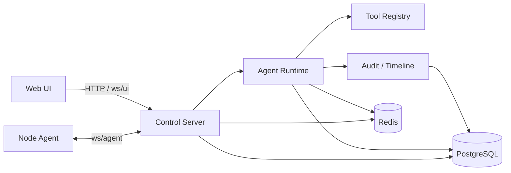

# ToLaTo MVP 后端核心架构设计

> 说明
> 
> 本文档主要保留为早期后端核心运行模型讨论稿。
> 
> 对于最新可实现基线，请优先以以下文档为准：
> 
> - [docs/backend_architecture_manual_loop.md](/Users/wentx/momaek/src/tolato/docs/backend_architecture_manual_loop.md)
> - [docs/session_interaction.md](/Users/wentx/momaek/src/tolato/docs/session_interaction.md)
> - [docs/api_contract.md](/Users/wentx/momaek/src/tolato/docs/api_contract.md)
> 
> 特别是：
> 
> - `Console` 之外的 `Nodes / History / Settings` 页面后端面
> - `ws/ui` 只服务 `Console` 的传输边界
> - 自研 Agent Loop + HTTP 查询配置面的最终收口方案
> 
> 均以后续专题文档为准。

## 1. 文档定位

本文档用于定义 ToLaTo MVP 后端的核心运行模型，重点回答以下问题：

- 后端如何承载一个持续运行的 Agent Loop
- 大模型可以调用哪些 Tool
- 用户点击确认 / 审批后，后端如何恢复执行
- 前端时间线 row 如何由后端事件驱动
- Control Server、Node Agent、数据库与 WebSocket 分别承担什么职责

本文档以 [docs/prd.md](/Users/wentx/momaek/src/tolato/docs/prd.md) 和 [docs/api_contract.md](/Users/wentx/momaek/src/tolato/docs/api_contract.md) 为产品与接口基线。

其中 session 切换、多 session 订阅、snapshot 恢复和 WebSocket request/response 模型的专项定义，见 [docs/session_interaction.md](/Users/wentx/momaek/src/tolato/docs/session_interaction.md)。

本文档不展开：

- 前端视觉设计
- 具体 SQL DDL
- 具体 OpenAI / Anthropic SDK 选型细节
- 部署、CI/CD、IaC

---

## 2. 核心结论

ToLaTo MVP 的后端核心不是“Plan Engine + Approval Engine + Executor”这种静态流水线，而是：

`一个运行在 Control Server 内部的 Agent Loop`

该 Loop 具备以下特征：

- LLM 在后端运行，API key 只保存在服务端
- LLM 自主决定调用哪个 Tool
- Tool 调用和结果都由后端记录并推送给前端
- 前端只展示时间线 row，不参与编排决策
- 用户点击确认 / Approve / Reject 时，不生成新的 user row
- 这类点击动作由后端 runtime 直接处理，并追加一条 `tool_meta row`
- 用户动作处理完成后，后端继续恢复 Agent Loop

一句话：

`前端负责展示，后端负责 Agent Loop、Tool 调用、审批边界、执行编排和审计。`

---

## 3. 总体架构

### 3.1 组件视图



### 3.2 核心职责

#### Web UI

- 发送用户消息
- 展示 row-based 时间线
- 承载按钮型确认 / 审批交互
- 不直接调用 LLM
- 不直接决定调用哪个 Tool

#### Control Server

- 持有会话上下文
- 驱动 Agent Loop
- 向模型暴露 Tool Catalog
- 执行 Tool
- 管理目标确认和审批等待态
- 调度节点执行
- 记录审计与时间线
- 向前端推送 row 事件

#### Node Agent

- 接收受控动作
- 在节点上执行 allowlist action
- 流式回传 stdout / stderr / 状态
- 不做规划、不做审批、不与 LLM 对话

---

## 4. 运行模型：Agent Loop

### 4.1 基本循环

每轮用户消息到来后，后端进入一次 Agent Loop：

1. 读取 thread 历史、当前目标上下文、挂起状态
2. 将消息和 Tool Catalog 送入 LLM
3. LLM 输出 assistant 文本或 Tool Call
4. 后端执行 Tool
5. 把 `tool_call` / `tool_result` 写入审计和时间线
6. 把 Tool Result 作为下一轮上下文回喂给 LLM
7. 重复上述过程，直到：
   - 需要等待用户确认目标
   - 需要等待用户审批
   - 已经下发执行，转入异步执行态
   - 已经产出总结

### 4.2 循环终止点

MVP 中 Agent Loop 可以在以下几种条件下暂停：

- `wait_target_confirmation`
- `wait_approval`
- `execution_running`
- `completed`
- `failed`

其中前两种是“等用户动作”，后两种是“等系统异步事件”。

### 4.3 伪代码

```go
for {
    output := llm.Run(ctx, conversation, toolCatalog)

    switch output.Type {
    case AssistantMessage:
        timeline.AppendAssistantRow(threadID, output.Text)
        if output.Done {
            return nil
        }

    case ToolCall:
        timeline.AppendToolCallMeta(threadID, output.ToolName, output.Args)

        result, err := tools.Call(ctx, output.ToolName, output.Args)
        if err != nil {
            timeline.AppendToolResultMeta(threadID, output.ToolName, "failed", err.Error())
            return err
        }

        timeline.AppendToolResultMeta(threadID, output.ToolName, "succeeded", result.MetaText)

        if result.WaitForUser {
            runtime.PersistPendingState(threadID, result.PendingState)
            return nil
        }

        if result.AsyncExecutionStarted {
            runtime.BindExecution(threadID, result.ExecutionID)
            return nil
        }

        conversation = append(conversation, result.AsToolMessage())
    }
}
```

---

## 5. 分层设计

服务端内部建议采用：

`transport -> app/usecase -> domain -> infra`

### 5.1 `transport`

职责：

- HTTP / WebSocket 协议处理
- 用户身份提取
- 参数绑定和错误映射
- 将用户事件转交给 runtime

不负责：

- 直接调用仓储
- 直接拼装 LLM prompt
- 直接执行 Tool

### 5.2 `app/usecase`

职责：

- 组织 Agent Loop
- 处理用户按钮动作
- 组织事务边界
- 将领域状态变更转成时间线事件

建议核心对象：

- `Runtime`
- `ThreadService`
- `ApprovalService`
- `ExecutionService`
- `TimelineService`

### 5.3 `domain`

职责：

- Thread
- ActiveTargetContext
- PendingAction
- ToolCall / ToolResult
- Task / Execution
- 审批和执行状态机

### 5.4 `infra`

职责：

- PostgreSQL repositories
- Redis pubsub / cache / dispatch queue
- LLM client
- WebSocket session hub
- ID / clock / logger

---

## 6. Tool 设计

## 6.1 Tool 设计原则

MVP 的 Tool 设计遵循以下原则：

- 模型只看到受控 Tool，不看到任意 shell
- Tool 名称和输入输出 schema 必须稳定
- Tool 调用必须可审计、可回放
- Tool 返回结果必须足够驱动前端时间线展示
- 用户按钮动作不是模型 Tool，而是 runtime 事件

## 6.2 模型可调用的顶层 Tool

### `list_nodes`

用途：

- 获取当前用户可操作节点列表
- 给模型做目标解析、范围判断、消歧

建议输入：

```json
{
  "status": ["online", "stale"],
  "limit": 100
}
```

建议输出：

```json
{
  "nodes": [
    {
      "id": "node_tokyo_01",
      "hostname": "jp-tokyo-01",
      "region": "Tokyo",
      "tags": ["prod", "nginx"],
      "status": "online",
      "last_seen_at": "2026-03-21T12:00:00Z"
    }
  ]
}
```

### `get_node_details`

用途：

- 在模型已经锁定候选节点后，查询更详细的节点信息

### `resolve_target_nodes`

用途：

- 基于用户输入、节点清单和历史上下文解析目标节点

返回：

- 候选节点
- 匹配原因
- 置信度
- 是否需要用户确认

### `request_target_confirmation`

用途：

- 将“待确认目标”写入 thread 状态
- 追加一条 `target_confirmation row`
- 让 Loop 停在等待用户动作

返回：

- `WaitForUser = true`
- `PendingAction = target_confirmation`

### `propose_plan`

用途：

- 针对已确认目标生成结构化 plan

返回：

- steps
- risk
- impact
- requiresApproval

同时：

- 追加 `plan row`

### `request_approval`

用途：

- 对需要审批的计划发起审批请求
- 追加 `approval row`
- 让 Loop 停在等待用户动作

返回：

- `WaitForUser = true`
- `PendingAction = approval`

### `exec_on_nodes`

用途：

- 将结构化计划拆解为节点级执行任务
- 分发到 Node Agent

返回：

- task / execution id
- 初始执行状态
- `AsyncExecutionStarted = true`

### `get_execution_status`

用途：

- 查询执行进度
- 供模型在需要时主动查看异步执行结果

### `summarize_execution`

用途：

- 读取聚合执行结果并生成总结
- 追加 `summary row`

## 6.3 `exec_on_nodes` 下的 allowlist action

这些不是模型直接看到的顶层 Tool，而是节点侧受控动作：

- `system_status`
- `disk_usage`
- `memory_usage`
- `docker_ps`
- `service_status`
- `tail_log`
- `restart_service`
- `reload_service`
- `network_check`

## 6.4 不暴露给模型的 runtime 动作

以下动作由后端 runtime 直接处理，不作为 LLM Tool 暴露：

- 用户点击 `确认目标`
- 用户点击 `Approve`
- 用户点击 `Reject`
- 用户点击 `Cancel`
- 清理挂起状态
- 追加 `tool_meta row`
- 审计落库
- 推送 WebSocket timeline event

原因：

- 它们是确定性的系统动作，不需要模型决策
- 它们直接影响审批边界和审计完整性

---

## 7. 时间线 Row 与事件流

## 7.1 时间线原则

前端消息流必须按 row 追加，不回头修改旧 row 的主要语义。

典型顺序：

1. `user_message`
2. `assistant_text` 或 `target_confirmation`
3. `tool_meta`
4. `plan`
5. `approval`
6. `tool_meta`
7. `execution`
8. `summary`

## 7.2 为什么需要 `tool_meta row`

因为按钮型确认 / 审批本质上是一次后端系统动作，不是新的用户自然语言消息。

因此：

- 点击按钮后不新增 `user_message`
- 后端直接处理动作
- 追加一条弱化的 `tool_meta row`

示例：

- `target_confirmation succeeded · jp-tokyo-01 confirmed`
- `approval recorded · execution unlocked`
- `approval rejected · task blocked`

## 7.3 WebSocket 事件

建议 UI WebSocket 推送以下事件：

- `timeline.row.appended`
- `thread.target.pending`
- `thread.target.confirmed`
- `thread.target.cleared`
- `task.status`
- `execution.chunk`
- `execution.finished`

其中：

- `timeline.row.appended` 是前端时间线的主驱动事件
- 其余事件可用于顶部状态、执行进度和局部刷新

---

## 8. 用户动作恢复机制

## 8.1 目标确认

当 `request_target_confirmation` 执行后：

- thread 写入 `pending_action = target_confirmation`
- thread 写入候选目标上下文
- timeline 追加 `target_confirmation row`
- Agent Loop 暂停

当用户点击“确认目标”：

1. transport 接收按钮事件
2. runtime 校验当前 thread 确实处于 `target_confirmation` 挂起态
3. runtime 将目标上下文改为 `confirmed`
4. runtime 追加 `tool_meta row`
5. runtime 清除 `pending_action`
6. runtime 重新唤起 Agent Loop

## 8.2 审批

当 `request_approval` 执行后：

- thread 写入 `pending_action = approval`
- timeline 追加 `approval row`
- Agent Loop 暂停

当用户点击 `Approve`：

1. transport 接收按钮事件
2. runtime 校验当前 thread 处于 `approval` 挂起态
3. runtime 写入审批记录
4. runtime 追加 `tool_meta row`
5. runtime 清除 `pending_action`
6. runtime 恢复 Agent Loop

当用户点击 `Reject`：

1. 记录拒绝动作
2. 追加 `tool_meta row`
3. 将当前计划标记为 rejected
4. 不恢复到执行链路

---

## 9. 数据对象建议

## 9.1 `Thread`

建议至少包含：

- `id`
- `status`
- `active_target_context`
- `pending_action_type`
- `pending_action_payload`
- `last_agent_state`
- `created_at`
- `updated_at`

## 9.2 `TimelineRow`

建议字段：

- `id`
- `thread_id`
- `kind`
- `payload`
- `created_at`

`kind` 建议枚举：

- `user_message`
- `assistant_text`
- `target_confirmation`
- `plan`
- `approval`
- `execution`
- `summary`
- `tool_meta`

## 9.3 `ToolCall`

建议字段：

- `id`
- `thread_id`
- `tool_name`
- `arguments_json`
- `status`
- `created_at`

## 9.4 `ToolResult`

建议字段：

- `id`
- `tool_call_id`
- `status`
- `payload_json`
- `meta_text`
- `created_at`

## 9.5 `Task` / `Execution`

`Task` 用于逻辑级执行意图，`Execution` 用于节点级实际执行。

建议：

- 一个 plan 对应一个 task
- 一个 task 对应多个 execution

---

## 10. Runtime 结构建议

建议在 `internal/server/app/usecase/runtime.go` 一类模块中承载以下职责：

- `HandleUserMessage`
- `ResumeAfterTargetConfirmation`
- `ResumeAfterApproval`
- `HandleToolCall`
- `HandleAsyncExecutionFinished`

可以抽象为：

```go
type Runtime struct {
    llm        LLMClient
    tools      ToolRegistry
    threads    ThreadRepository
    timeline   TimelineRepository
    tasks      TaskRepository
    executions ExecutionRepository
    audits     AuditRepository
    ws         UIEventPublisher
}
```

建议核心接口：

```go
type Tool interface {
    Name() string
    Call(ctx context.Context, in json.RawMessage) (ToolResult, error)
}

type ToolRegistry interface {
    Call(ctx context.Context, name string, in json.RawMessage) (ToolResult, error)
    Definitions() []ToolDefinition
}
```

`ToolResult` 至少应能表达：

- 是否需要等待用户
- 是否已启动异步执行
- 是否需要追加某类 row
- 返回给模型的结构化结果

---

## 11. Node Agent 执行模型

Node Agent 保持简单：

- 建立 `ws/agent`
- 上报 heartbeat
- 接收 `task.dispatch`
- 执行 allowlist action
- 回传 stdout / stderr / exit code

Node Agent 不承担：

- 目标解析
- 审批
- LLM 调用
- 总结生成

---

## 12. Redis 与 PostgreSQL 分工

### PostgreSQL

作为事实源，保存：

- thread
- timeline rows
- tool_calls
- tool_results
- tasks
- executions
- audits

### Redis

作为临时和异步组件，保存：

- 在线节点会话索引
- dispatch queue
- execution stream 广播
- 短期锁和幂等键

原则：

- 审批、目标确认、时间线和执行结果最终都要落 PostgreSQL
- Redis 不能成为唯一事实源

---

## 13. MVP 边界

MVP 不做：

- 任意 shell tool
- 交互式终端
- 模型直接访问节点
- 模型绕过审批
- 用户点击按钮后再让模型决定“是否生效”

MVP 必须保证：

- LLM 只在后端运行
- Tool 调用全链路可审计
- 用户按钮型确认 / 审批不新增 user row
- 前端时间线由后端事件驱动
- Node Agent 只执行 allowlist action

---

## 14. 一句话总结

ToLaTo MVP 的后端核心应当实现为：

`Control Server 内的一个显式 Agent Loop，模型自主决定调用 Tool，后端负责执行 Tool、记录时间线与审计、处理用户按钮事件，并在目标确认和审批边界上安全地暂停与恢复。`
