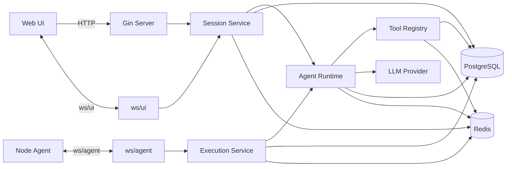
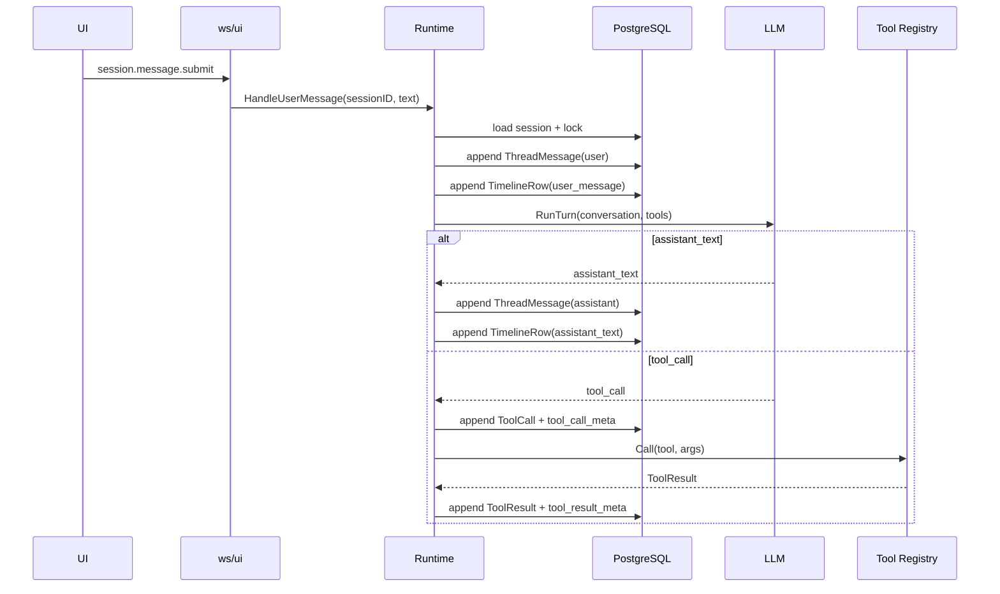
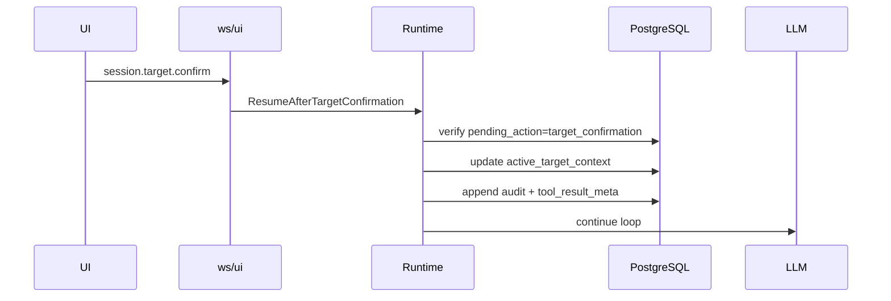
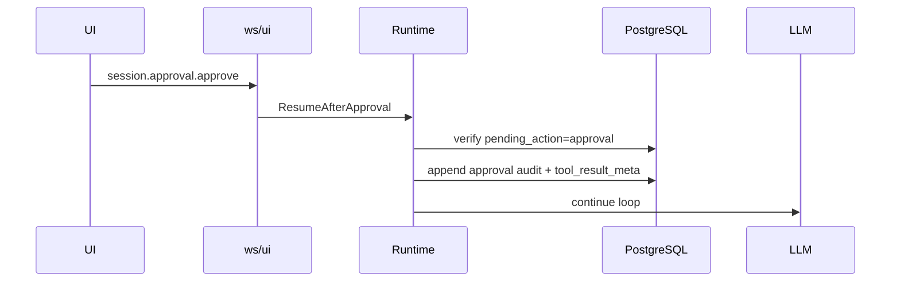
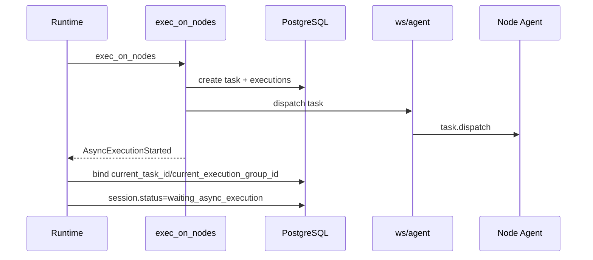
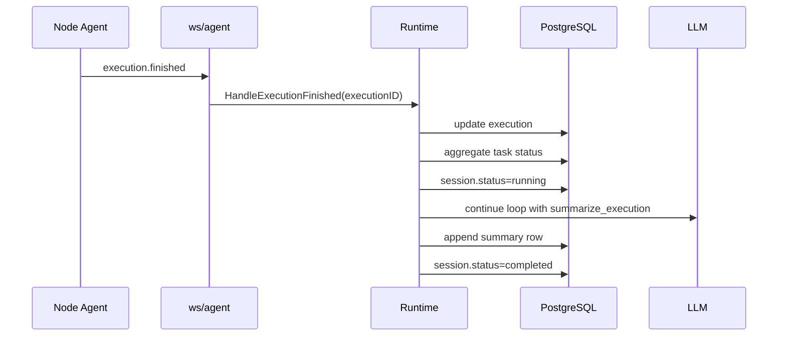
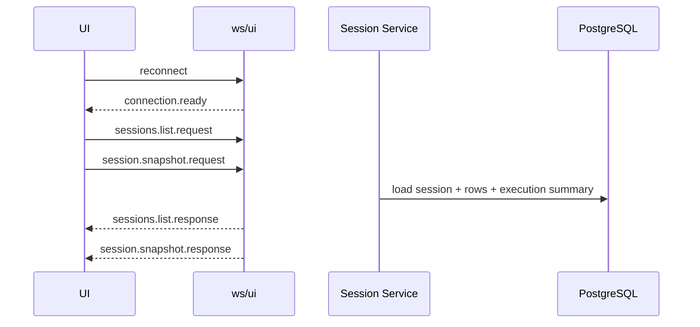

# ToLaTo MVP 后端架构设计（自研 Agent Loop + Gin）

## 1. 文档定位

本文档定义 ToLaTo MVP 后端的最终可实现架构，重点回答以下问题：

- 为什么本项目采用自研 `Agent Loop Runtime`，而不是引入通用 Agent 编排框架
- `Gin`、`ws/ui`、`ws/agent`、`PostgreSQL`、`Redis`、`Node Agent` 分别承担什么职责
- session、聊天消息、时间线、任务、执行、审计、provider continuation state 应该如何拆分
- Agent Loop 如何暂停、恢复、绑定异步 execution，并在执行完成后继续总结
- 前端如何通过 `ws/ui` 请求/响应与增量事件恢复完整 session 页面

本文档以以下文档为产品与交互基线：

- [docs/prd.md](/Users/wentx/momaek/src/tolato/docs/prd.md)
- [docs/backend_architecture.md](/Users/wentx/momaek/src/tolato/docs/backend_architecture.md)
- [docs/session_interaction.md](/Users/wentx/momaek/src/tolato/docs/session_interaction.md)
- [docs/api_contract.md](/Users/wentx/momaek/src/tolato/docs/api_contract.md)

本文档与旧文档的关系：

- 旧文档继续保留，主要承载产品意图、交互语义和前期讨论结果
- 本文档给出最终的后端技术架构与实现边界
- 传输模型以 `Gin + ws/ui request/response + event push` 为准
- `Console` 之外的 `Nodes / History / Settings` 页面以后端 HTTP 查询与配置接口为准

本文档不展开：

- 具体 SQL DDL
- 具体 OpenAI API 原语选型
- 前端视觉设计
- 部署、CI/CD、IaC

---

## 2. 核心结论

ToLaTo MVP 的后端核心应实现为：

`一个运行在 Control Server 内部、由 Gin 承载入口、自研显式状态机驱动的 Agent Loop Runtime`

该架构具备以下特征：

- `Gin` 是统一接入层，承载 HTTP、`ws/ui`、`ws/agent`
- session 业务主通道是 `ws/ui`
- 后端分为 `Console` 实时会话面与 `Nodes / History / Settings` HTTP 查询配置面
- LLM 只在服务端运行，模型只看到受控 Tool Catalog
- 后端显式维护 session 状态、暂停点、恢复点和异步 execution 绑定
- `PostgreSQL` 是唯一事实源
- `Redis` 只提供锁、连接索引、事件分发和 fanout
- `Node Agent` 只执行 allowlist action，不参与规划、审批或总结

一句话：

`前端负责显示，Gin 负责接入，自研 Runtime 负责 Agent Loop、Tool 调用、审批边界、执行编排和恢复。`

---

## 3. 为什么不用通用 Agent 框架

本项目的 Agent Loop 目标不是“复杂多分支 Agent Graph”，而是“少量暂停点、强审计、可恢复的受控聊天执行流”。

选择自研 loop 的原因：

- Loop 结构简单，核心只是 `模型输出 -> tool -> 再喂模型` 的显式循环
- 关键复杂度不在推理图，而在：
  - session 状态
  - 审批和目标确认边界
  - 异步 execution 生命周期
  - timeline 与审计落库
  - 服务重启后的恢复
- 这些边界本质上是业务 runtime 问题，不是通用 Agent 框架最擅长的部分
- 自研 loop 更容易做到：
  - 明确可审计
  - 易调试
  - 恢复路径可控
  - 不被框架状态机语义绑死

因此，本架构选择：

- 不引入 Eino、LangGraph 或其他 Agent orchestration framework
- 用显式 Go 代码实现 loop、暂停、恢复和异步执行编排
- 仅在 `infra/llm` 层保留模型 provider 适配接口

---

## 4. 技术选型与职责边界

### 4.1 Gin

`Gin` 是统一接入层，职责包括：

- HTTP：
  - 登录 / 鉴权 / bootstrap
  - 健康检查
  - `Nodes / History / Settings` 查询与配置接口
  - 非会话型管理接口
- `ws/ui`：
  - `Console` session 业务请求 / 响应
  - timeline / execution / summary 实时事件推送
- `ws/agent`：
  - Node Agent 注册、heartbeat、dispatch、execution stream 回传

`Gin` 不负责：

- 拼装模型上下文
- 调用 LLM
- 执行 Tool 业务逻辑
- 实现 session 状态机

### 4.2 Agent Runtime

自研 `Agent Runtime` 负责：

- 读取 session 当前状态
- 读取对话历史、tool 调用历史、目标上下文
- 调用 `LLMClient`
- 执行 Tool
- 写入 `ThreadMessage`、`TimelineRow`、`ToolCall`、`ToolResult`、`Audit`
- 在 `wait_target_confirmation`、`wait_approval`、`waiting_async_execution` 上暂停
- 在用户动作或 execution 结束后恢复 loop

### 4.3 LLM Provider

模型适配层通过统一接口接入，职责：

- 接收输入上下文与 Tool Catalog
- 返回统一的模型输出结构
- 可选地返回 provider-specific continuation state

本层不负责：

- 持久化事实数据
- session 状态迁移
- 时间线写入

### 4.4 PostgreSQL

`PostgreSQL` 是唯一事实源，保存：

- sessions
- thread_messages
- timeline_rows
- tool_calls
- tool_results
- tasks
- executions
- audits
- agent_provider_state
- model_config
- user_preferences
- user_sessions
- account_credentials
- node_metrics_latest
- task_history_projection

### 4.5 Redis

`Redis` 只提供临时能力：

- `session_id` 级互斥锁
- UI/Agent 在线连接索引
- execution chunk fanout
- Node Agent dispatch queue 或 pubsub
- 短期幂等键

原则：

- Redis 不保存唯一事实
- 所有影响恢复和审计的关键状态最终都要落 PostgreSQL

### 4.6 Node Agent

Node Agent 负责：

- 建立 `ws/agent`
- 上报 heartbeat
- 接收 `task.dispatch`
- 执行 allowlist action
- 回传 stdout / stderr / exit code / status

Node Agent 不负责：

- 调用模型
- 目标解析
- 审批
- 生成总结

---

## 5. 总体架构

### 5.1 组件视图



### 5.2 控制面分层

服务端内部固定采用：

`transport -> app -> domain -> infra`

分层职责：

- `transport`
  - Gin HTTP 路由
  - UI WebSocket
  - Agent WebSocket
- `app`
  - Runtime
  - Session Service
  - Execution Service
  - Timeline Service
- `domain`
  - Session
  - PendingAction
  - ActiveTargetContext
  - Task
  - Execution
  - TimelineRow
- `infra`
  - Postgres repositories
  - Redis locks / fanout / dispatch
  - LLM provider adapters
  - WebSocket hub

---

## 6. 传输模型

## 6.1 总体原则

本架构采用：

`HTTP + ws/ui + ws/agent`

但后端明确分成两条产品面：

- `Console`
  - 以 `ws/ui` 为主
  - 承载 session、timeline、execution 流
- `Nodes / History / Settings`
  - 以 HTTP 为主
  - 承载查询投影、配置写入和非实时页面数据

具体分工：

- HTTP：
  - 登录 / 鉴权 / bootstrap
  - 健康检查
  - `GET /api/v1/nodes`
  - `GET /api/v1/nodes/{id}`
  - `GET /api/v1/history/tasks`
  - `GET /api/v1/history/tasks/{id}`
  - `GET/PUT /api/v1/settings/model-config`
  - `POST /api/v1/settings/model-config/test`
  - `POST /api/v1/settings/password/change`
  - `POST /api/v1/settings/sessions/revoke-others`
  - `GET/PUT /api/v1/settings/preferences`
- `ws/ui`：
  - `Console` 会话业务 request/response
  - session snapshot
  - 用户消息
  - 目标确认
  - approve / reject / cancel
  - timeline / execution / summary 增量事件
- `ws/agent`：
  - 节点连接与 dispatch
  - execution chunk / finished 回传

### 6.2 为什么会话业务不走 HTTP

会话业务主通道选择 `ws/ui`，原因：

- session 本身就是实时运行单元
- 前端已经需要基于 WebSocket 订阅 timeline 和 execution 流
- 统一 request/response + event push 可减少一套并行契约
- 更适合 active session 与 watched sessions 的多订阅模型

因此：

- 不设计 HTTP 与 `ws/ui` 双入口提交同一种 session 动作
- 用户消息和按钮动作都走 `ws/ui`
- `Nodes / History / Settings` 不通过 `ws/ui` 取数
- HTTP 查询面不参与 Agent Loop 编排

### 6.3 `ws/ui` 请求 / 响应模型

建议固定以下消息：

```ts
type UiWsRequest =
  | { type: "sessions.list.request"; requestId: string }
  | { type: "session.snapshot.request"; requestId: string; sessionId: string }
  | { type: "session.message.submit"; requestId: string; sessionId: string; text: string; clientMessageId: string }
  | { type: "session.target.confirm"; requestId: string; sessionId: string; nodeIds: string[]; scope: "single" | "multi" | "all_online"; idempotencyKey: string }
  | { type: "session.approval.approve"; requestId: string; sessionId: string; taskId: string; idempotencyKey: string }
  | { type: "session.approval.reject"; requestId: string; sessionId: string; taskId: string; reason?: string; idempotencyKey: string }
  | { type: "session.operation.cancel"; requestId: string; sessionId: string; taskId: string; idempotencyKey: string }
  | { type: "subscriptions.update"; requestId: string; activeSessionId: string; watchSessionIds: string[] }
```

```ts
type UiWsResponse =
  | { type: "connection.ready"; timestamp: string }
  | { type: "sessions.list.response"; requestId: string; items: SessionListItem[] }
  | { type: "session.snapshot.response"; requestId: string; snapshot: SessionSnapshot }
  | { type: "session.action.accepted"; requestId: string; sessionId: string; timestamp: string }
  | { type: "error"; requestId?: string; code: string; message: string }
```

### 6.4 `ws/ui` 推送事件

```ts
type UiWsEvent =
  | { type: "session.state.updated"; sessionId: string; status: SessionStatus; revision: number; timestamp: string }
  | { type: "timeline.row.appended"; sessionId: string; row: TimelineRow; revision: number; timestamp: string }
  | { type: "thread.target.pending"; sessionId: string; targetContext: ActiveTargetContext; revision: number; timestamp: string }
  | { type: "thread.target.confirmed"; sessionId: string; targetContext: ActiveTargetContext; revision: number; timestamp: string }
  | { type: "thread.target.cleared"; sessionId: string; revision: number; timestamp: string }
  | { type: "execution.chunk"; sessionId: string; taskId: string; executionId: string; nodeId: string; chunk: ExecutionChunk; timestamp: string }
  | { type: "execution.finished"; sessionId: string; taskId: string; executionId: string; nodeId: string; status: string; timestamp: string }
  | { type: "session.summary.updated"; sessionId: string; summary: SessionSummary; timestamp: string }
  | { type: "session.finished"; sessionId: string; summary: SessionSummary; timestamp: string }
```

### 6.5 `ws/agent` 协议职责

`ws/agent` 至少支持：

- agent 注册
- heartbeat
- dispatch 下发
- stdout/stderr chunk
- finish / exit_code / status
- 节点断线通知

### 6.6 WebSocket 代码级架构

WS 这条线固定拆成：

- `transport/wsui`
  - 处理 UI 侧 `ws/ui` 协议
- `transport/wsagent`
  - 处理 Agent 侧 `ws/agent` 协议
- `infra/ws`
  - 提供共享连接底座、注册表、fanout、read/write pump

原则：

- `wsui` 和 `wsagent` 共享一套底层连接生命周期管理
- 协议分发在 transport 层完成，但 transport 不直接写业务状态
- runtime 和 execution service 只依赖 publisher / registry 接口，不直接操作 websocket 连接

### 6.7 `infra/ws` 共享底座

建议固定以下对象：

```go
type ClientKind string

const (
    ClientKindUI    ClientKind = "ui"
    ClientKindAgent ClientKind = "agent"
)

type Client interface {
    ID() string
    Kind() ClientKind
    Send(msg []byte) bool
    Close(code int, reason string)
}

type Hub interface {
    Register(client Client)
    Unregister(clientID string)
}

type SessionRegistry interface {
    SetActive(clientID string, sessionID string)
    SetWatchSessions(clientID string, sessionIDs []string)
    PublishToSession(sessionID string, msg []byte)
    PublishSummary(sessionID string, msg []byte)
}

type AgentRegistry interface {
    BindNode(nodeID string, clientID string)
    UnbindNode(nodeID string, clientID string)
    PublishDispatch(nodeID string, msg []byte) error
}
```

每个连接固定两条 goroutine：

- `readPump`
  - 读帧
  - 校验协议
  - 分发到 dispatcher
- `writePump`
  - 消费 `send chan`
  - 统一写超时、ping/pong
  - 慢消费者熔断

统一规则：

- 每个 client 持有有界 `send chan`
- 写队列满时直接断开连接
- `Close()` 必须幂等
- transport 层不允许直接在任意 goroutine 上裸写 websocket

### 6.8 `ws/ui` 代码结构

`transport/wsui` 建议拆为：

- `handler.go`
  - 连接升级
  - 鉴权
  - 创建 `UIClient`
  - 注册 / 反注册
- `protocol.go`
  - `UiWsRequestEnvelope`
  - `UiWsResponseEnvelope`
  - 事件编码器
- `dispatcher.go`
  - 根据 `type` 分发 session 业务请求

建议固定 envelope：

```go
type UIRequestEnvelope struct {
    Type      string          `json:"type"`
    RequestID string          `json:"requestId,omitempty"`
    Payload   json.RawMessage `json:"payload,omitempty"`
}

type UIResponseEnvelope struct {
    Type      string      `json:"type"`
    RequestID string      `json:"requestId,omitempty"`
    Payload   interface{} `json:"payload,omitempty"`
    Error     *ErrorBody  `json:"error,omitempty"`
}
```

`wsui.Dispatcher` 固定路由：

- `sessions.list.request` -> `session.Service.ListSessions`
- `session.snapshot.request` -> `session.Service.BuildSnapshot`
- `session.message.submit` -> `runtime.HandleUserMessage`
- `session.target.confirm` -> `runtime.ResumeAfterTargetConfirmation`
- `session.approval.approve` -> `runtime.ResumeAfterApproval`
- `session.approval.reject` -> `runtime.ResumeAfterApproval`
- `session.operation.cancel` -> `execution.Service.CancelTask`
- `subscriptions.update` -> `session.Service.UpdateSubscriptions`

### 6.9 `ws/agent` 代码结构

`transport/wsagent` 建议拆为：

- `handler.go`
  - 连接升级
  - agent 鉴权
  - 注册 node <-> client 绑定
  - 断线清理
- `protocol.go`
  - `AgentMessage`
  - `DispatchCommand`
- `dispatcher.go`
  - heartbeat / chunk / finished 路由

建议固定消息外壳：

```go
type AgentMessage struct {
    Type    string          `json:"type"`
    NodeID  string          `json:"nodeId,omitempty"`
    TaskID  string          `json:"taskId,omitempty"`
    Payload json.RawMessage `json:"payload,omitempty"`
}
```

固定入口：

- `agent.register`
- `agent.heartbeat`
- `execution.chunk`
- `execution.finished`

固定下发：

- `task.dispatch`
- `agent.ack`
- `agent.error`

### 6.10 发布器与连接态边界

runtime 和 execution service 不直接触碰 websocket client，而是依赖发布器接口：

```go
type UIEventPublisher interface {
    PublishSessionEvent(ctx context.Context, sessionID string, evt any) error
    PublishSessionSummary(ctx context.Context, sessionID string, evt any) error
}

type AgentDispatchPublisher interface {
    DispatchToNode(ctx context.Context, nodeID string, cmd DispatchCommand) error
}
```

状态边界固定为：

- websocket 连接态
  - `client_id`
  - `connected_at`
  - `last_pong_at`
  - `send_queue_len`
- UI 订阅态
  - `active_session_id`
  - `watch_session_ids`
- Agent 在线态
  - `node_id`
  - `client_id`
  - `last_heartbeat_at`
- session 业务态
  - 只放 PostgreSQL，不放 ws hub

结论：

- hub 只管“谁在线、谁订阅了谁”
- session/runtime 只管“当前业务状态是什么”

### 6.11 慢连接、断线和覆盖策略

这部分必须写死：

- UI 慢消费者：
  - `send chan` 满后直接断开
- Agent 重复上线：
  - 新连接成功后踢掉旧连接
- Agent 断线：
  - transport 只做解绑和通知
  - execution 状态变更由 `execution.Service` 决定
- 所有 session 推送：
  - 必须带 `sessionId + revision`
- 所有按钮动作：
  - 必须带 `requestId + idempotencyKey`

---

## 7. Session、消息、时间线与执行模型

### 7.1 `Session` 的角色

`Session` 不是消息表，也不是执行明细表，而是运行容器。

`Session` 保存：

- 当前 `status`
- 当前 `active_target_context`
- 当前挂起动作
- 当前 operation / task / execution group 的引用
- 用于恢复 loop 的 `last_agent_state`
- provider-specific continuation state
- 会话级摘要字段

建议最小字段：

```go
type Session struct {
    ID                      string
    Title                   string
    Status                  SessionStatus
    ActiveTargetContext     ActiveTargetContext
    PendingActionType       *string
    PendingActionPayload    []byte
    CurrentOperationID      *string
    CurrentTaskID           *string
    CurrentExecutionGroupID *string
    LastAgentState          []byte
    ProviderStateBlob       []byte
    Revision                int64
    UpdatedAt               time.Time
}
```

原则：

- session 只保存运行态和引用
- 不直接内嵌完整聊天记录
- 不直接内嵌 timeline rows
- 不直接内嵌 stdout/stderr 流

### 7.2 `ThreadMessage`

`ThreadMessage` 保存真正的对话事实：

- `user_message`
- `assistant_text`

建议字段：

```go
type ThreadMessage struct {
    ID        string
    SessionID string
    Role      string
    Kind      string
    Content   string
    CreatedAt time.Time
}
```

### 7.3 `TimelineRow`

`TimelineRow` 保存 UI 展示事实，不等于对话消息。

建议字段：

```ts
type TimelineRow =
  | { id: string; sessionId: string; kind: "user_message"; createdAt: string; text: string }
  | { id: string; sessionId: string; kind: "assistant_text"; createdAt: string; text: string }
  | { id: string; sessionId: string; kind: "target_confirmation"; createdAt: string; targetContext: ActiveTargetContext }
  | { id: string; sessionId: string; kind: "tool_call_meta"; createdAt: string; toolName: string; argsPreview?: string; source: "agent_loop" }
  | { id: string; sessionId: string; kind: "tool_result_meta"; createdAt: string; toolName: string; status: "succeeded" | "failed"; text: string; source: "agent_loop" | "user_action" }
  | { id: string; sessionId: string; kind: "plan"; createdAt: string; taskId: string }
  | { id: string; sessionId: string; kind: "approval"; createdAt: string; taskId: string }
  | { id: string; sessionId: string; kind: "execution"; createdAt: string; taskId: string }
  | { id: string; sessionId: string; kind: "summary"; createdAt: string; taskId: string }
```

### 7.4 `Task` 与 `Execution`

`Task` 表示一次逻辑执行意图，`Execution` 表示节点级实际执行。

```go
type Task struct {
    ID                      string
    SessionID               string
    OperationTargetSnapshot TargetSnapshot
    Status                  string
    ApprovalStatus          string
    Summary                 *string
    CreatedAt               time.Time
    UpdatedAt               time.Time
}
```

```go
type Execution struct {
    ID           string
    TaskID       string
    SessionID    string
    NodeID       string
    Status       string
    StartedAt    *time.Time
    FinishedAt   *time.Time
    ExitCode     *int
    StdoutTail   string
    StderrTail   string
    StatusReason *string
}
```

原则：

- `session.active_target_context` 可变
- `task.operation_target_snapshot` 不可变
- 即使 session 后续切换目标，旧 task / execution 审计仍绑定原始快照

### 7.5 `provider_state_blob`

`provider_state_blob` 的语义是：

- 允许 provider-specific 的轻量 continuation state
- 不是事实源
- 不是恢复主路径的唯一输入

恢复优先级：

1. `thread_messages`
2. `tool_results`
3. `session` 状态
4. `provider_state_blob` 作为可选辅助

同时建议保留 `agent_provider_state` 表，用于版本化保存 provider continuation payload，便于调试和回溯。

---

## 8. 页面查询面与后端子系统

### 8.1 `app/nodeview`

`app/nodeview` 负责为 `/nodes` 与 `/nodes/:id` 生成查询投影。

职责：

- 节点列表搜索、筛选、排序
- 聚合 `busy / idle`
- 返回最近资源摘要 `cpu / memory / disk`
- 返回最近心跳时间
- 返回最近任务摘要

建议接口：

```go
type NodeViewService interface {
    ListNodes(ctx context.Context, query ListNodesQuery) (NodeListPage, error)
    GetNodeDetail(ctx context.Context, nodeID string) (NodeDetailView, error)
}
```

### 8.2 `app/history`

`app/history` 负责为 `/history` 输出 task 级历史视图。

职责：

- task 列表
- 按状态和审批状态筛选
- 聚合 plan / approval / execution / audit
- 将 `tool_call_meta` / `tool_result_meta` 作为 task detail 的关联数据输出

建议接口：

```go
type HistoryService interface {
    ListTasks(ctx context.Context, query ListTasksQuery) (TaskHistoryPage, error)
    GetTaskDetail(ctx context.Context, taskID string) (TaskHistoryDetail, error)
}
```

约束：

- 不单独暴露独立审计中心
- 审计信息只作为 task detail 的关联内容提供

### 8.3 `app/settings`

`app/settings` 负责 `/settings` 后端能力。

职责：

- `model_config`
  - provider / model / endpoint / api_key / temperature / max_tokens / timeout
  - 连接测试
- `account_security`
  - 改密码
  - 当前登录信息
  - 登出其他会话
- `preferences`
  - 语言
  - 时间格式
  - 默认视图
  - 执行结果展开偏好

建议接口：

```go
type SettingsService interface {
    GetModelConfig(ctx context.Context, userID string) (ModelConfigView, error)
    PutModelConfig(ctx context.Context, userID string, in UpdateModelConfigInput) error
    TestModelConfig(ctx context.Context, userID string, in TestModelConfigInput) (ModelConfigTestResult, error)

    ChangePassword(ctx context.Context, userID string, in ChangePasswordInput) error
    RevokeOtherSessions(ctx context.Context, userID string, currentSessionID string) error

    GetPreferences(ctx context.Context, userID string) (UserPreferencesView, error)
    PutPreferences(ctx context.Context, userID string, in UpdatePreferencesInput) error
}
```

### 8.4 `app/policy`

`app/policy` 负责统一风险分级与执行准入判断。

职责：

- action risk level 判定
- allowlist action / args 校验
- broadcast write 限制
- `low / medium / high / forbidden` 的准入逻辑

建议接口：

```go
type PolicyService interface {
    EvaluatePlan(ctx context.Context, plan ExecutionPlan) (PolicyDecision, error)
}
```

`PolicyDecision` 至少应能表达：

- `risk_level`
- `requires_approval`
- `blocked`
- `blocked_reason`
- `broadcast_allowed`

---

## 9. Tool 设计

### 8.1 暴露给模型的 Tool

首版固定为：

- `list_nodes`
- `resolve_target_nodes`
- `propose_plan`
- `request_approval`
- `exec_on_nodes`
- `get_execution_status`
- `summarize_execution`

### 8.2 Tool 接口

```go
type Tool interface {
    Name() string
    Definition() ToolDefinition
    Call(ctx context.Context, input json.RawMessage) (ToolResult, error)
}

type ToolResult struct {
    MetaText              string
    ToolMessage           json.RawMessage
    WaitForUser           bool
    PendingActionType     string
    PendingActionPayload  json.RawMessage
    AsyncExecutionStarted bool
    TaskID                string
    ExecutionGroupID      string
    AppendPlanRow         bool
    AppendApprovalRow     bool
    AppendExecutionRow    bool
    AppendSummaryRow      bool
}
```

### 8.3 不暴露给模型的 runtime 动作

以下动作由 runtime 直接处理：

- 确认目标
- approve / reject / cancel
- 追加按钮动作产生的 `tool_result_meta`
- session 状态切换
- 写审计
- 推送 `ws/ui` 事件

原因：

- 它们是确定性系统动作
- 它们直接影响审批边界和恢复语义
- 不应让模型决定这些动作是否生效

---

## 10. 手写 Agent Loop 运行模型

### 9.0 Runtime 与 Provider 核心接口

内部接口固定为：

```go
type Runtime interface {
    HandleUserMessage(ctx context.Context, sessionID string, text string, clientMessageID string) error
    ResumeAfterTargetConfirmation(ctx context.Context, sessionID string, action ConfirmTargetAction) error
    ResumeAfterApproval(ctx context.Context, sessionID string, action ApprovalAction) error
    HandleExecutionChunk(ctx context.Context, executionID string, chunk ExecutionChunk) error
    HandleExecutionFinished(ctx context.Context, executionID string, result ExecutionResult) error
    BuildSessionSnapshot(ctx context.Context, sessionID string) (SessionSnapshot, error)
}

type LLMClient interface {
    RunTurn(ctx context.Context, input ModelTurnInput, tools []ToolDefinition) (ModelTurnOutput, error)
}
```

其中：

- `Runtime` 是 app 层主入口，不暴露给 transport 以外的协议细节
- `LLMClient` 是 provider 中立接口，后续可由 `OpenAIProvider` 实现
- provider 必须返回统一的 `ModelTurnOutput`

### 9.1 核心循环

每轮用户消息进入后，runtime 执行：

1. 读取 session
2. 获取 `session_id` 级互斥锁
3. 校验 session 当前可进入 loop
4. 写 `ThreadMessage(user)`
5. 写 `TimelineRow(user_message)`
6. session.status -> `running`
7. 读取消息历史、tool 结果、target context、pending state、provider state
8. 构造模型输入和 Tool Catalog
9. 调用 `LLMClient.RunTurn`
10. 消费模型输出
11. 直到 loop 达到暂停点或完成

### 9.2 模型输出归一化

Provider 层统一输出：

```go
type ModelTurnOutput struct {
    AssistantText *string
    ToolCall      *ToolInvocation
    Done          bool
    ProviderState []byte
}

type ToolInvocation struct {
    Name string
    Args json.RawMessage
}
```

约束：

- 一次 turn 只处理一个主输出
- 若 provider 原生返回多个 item，由 `infra/llm` 归一为逐项消费模式

### 9.3 Loop 伪代码

```go
func (r *Runtime) HandleUserMessage(ctx context.Context, sessionID string, text string) error {
    lock := r.locker.LockSession(ctx, sessionID)
    defer lock.Unlock()

    session := r.sessions.GetForUpdate(ctx, sessionID)
    if !session.CanAcceptMessage() {
        return ErrSessionBusy
    }

    r.messages.AppendUser(ctx, sessionID, text)
    r.timeline.AppendUserRow(ctx, sessionID, text)
    session.MarkRunning()
    r.sessions.Save(ctx, session)

    conversation := r.rebuildConversation(ctx, sessionID, session)

    for {
        output, err := r.llm.RunTurn(ctx, conversation, r.tools.Definitions())
        if err != nil {
            session.MarkFailed(err)
            r.sessions.Save(ctx, session)
            return err
        }

        session.ProviderStateBlob = output.ProviderState

        switch {
        case output.AssistantText != nil:
            r.messages.AppendAssistant(ctx, sessionID, *output.AssistantText)
            r.timeline.AppendAssistantRow(ctx, sessionID, *output.AssistantText)
            if output.Done {
                session.MarkCompleted()
                r.sessions.Save(ctx, session)
                return nil
            }
            conversation = append(conversation, AssistantMessage(*output.AssistantText))

        case output.ToolCall != nil:
            r.toolCalls.Append(ctx, sessionID, output.ToolCall)
            r.timeline.AppendToolCallMeta(ctx, sessionID, output.ToolCall.Name, output.ToolCall.Args)

            result, err := r.tools.Call(ctx, output.ToolCall.Name, output.ToolCall.Args)
            if err != nil {
                r.toolResults.AppendFailed(ctx, sessionID, output.ToolCall.Name, err)
                r.timeline.AppendToolResultMeta(ctx, sessionID, output.ToolCall.Name, "failed", err.Error(), "agent_loop")
                session.MarkFailed(err)
                r.sessions.Save(ctx, session)
                return err
            }

            r.toolResults.AppendSuccess(ctx, sessionID, output.ToolCall.Name, result)
            r.timeline.AppendToolResultMeta(ctx, sessionID, output.ToolCall.Name, "succeeded", result.MetaText, "agent_loop")

            if result.WaitForUser {
                session.SetPending(result.PendingActionType, result.PendingActionPayload)
                r.sessions.Save(ctx, session)
                return nil
            }

            if result.AsyncExecutionStarted {
                session.BindExecution(result.TaskID, result.ExecutionGroupID)
                session.MarkWaitingAsyncExecution()
                r.sessions.Save(ctx, session)
                return nil
            }

            conversation = append(conversation, ToolResultMessage(result.ToolMessage))

        default:
            session.MarkFailed(errors.New("empty model output"))
            r.sessions.Save(ctx, session)
            return ErrEmptyModelOutput
        }
    }
}
```

### 9.4 暂停点

Loop 可以在以下条件暂停：

- `paused_wait_target_confirmation`
- `paused_wait_approval`
- `waiting_async_execution`
- `completed`
- `failed`

语义：

- 前两种表示等用户动作
- 第三种表示等系统异步事件
- 后两种表示本轮已结束

说明：

- `completed` 和 `failed` 不是 session 被销毁，而是“上一轮会话操作已完成/失败”
- 下一条新用户消息仍可把 session 从 `completed` 或 `failed` 重新推进到 `running`

### 9.5 同一 session 的并发策略

MVP 固定策略：

- 同一 session 同时只允许一个 active loop
- 当 session.status 为 `running`、`paused_wait_target_confirmation`、`paused_wait_approval`、`waiting_async_execution` 时，新的 `session.message.submit` 一律拒绝
- 返回错误码建议为 `session_busy`

不做：

- 消息排队
- 自动插队
- 在执行中接受新的自由文本消息

这样能保证：

- 恢复路径简单
- 审计边界清晰
- 前端 composer 状态明确

---

## 11. 用户动作恢复机制

### 10.1 目标确认

当 `request_target_confirmation` 返回 `WaitForUser` 后：

- session 写入 `pending_action_type = target_confirmation`
- session.status -> `paused_wait_target_confirmation`
- timeline 追加 `target_confirmation row`
- loop 结束

当收到 `session.target.confirm`：

1. 校验 session 当前确实处于 `paused_wait_target_confirmation`
2. 校验 idempotency key
3. 更新 `active_target_context`
4. 写 audit
5. 追加 `tool_result_meta`
6. 清理 `pending_action`
7. session.status -> `running`
8. 恢复 loop

### 10.2 审批

当 `request_approval` 返回 `WaitForUser` 后：

- session 写入 `pending_action_type = approval`
- session.status -> `paused_wait_approval`
- timeline 追加 `approval row`
- loop 结束

当收到 `session.approval.approve`：

1. 校验 session 当前确实处于 `paused_wait_approval`
2. 校验 idempotency key
3. 写审批审计
4. 追加 `tool_result_meta`
5. 清理 `pending_action`
6. session.status -> `running`
7. 恢复 loop

当收到 `session.approval.reject`：

1. 校验 pending action
2. 写拒绝审计
3. 追加 `tool_result_meta`
4. task 标记 `rejected`
5. session.status -> `completed`
6. 不恢复执行链路

### 10.3 幂等规则

按钮动作必须带 `idempotencyKey`。

规则：

- 同一 key 重复到达时返回同一结果，不重复推进状态
- 已不处于对应 pending state 的请求返回冲突错误

---

## 12. 异步 Execution 生命周期

### 11.1 为什么异步

`exec_on_nodes` 不适合作为同步 tool 在 loop 内一直等到底，原因：

- 远端执行可能持续数十秒甚至更久
- 执行可能是多节点并发
- 需要流式 stdout / stderr
- 需要在服务重启后恢复

因此，`exec_on_nodes` 的职责是：

- 创建 task
- 创建 execution
- 下发 dispatch
- 绑定 session 与 execution group
- 让 loop 转入 `waiting_async_execution`

### 11.2 状态迁移

执行启动时：

1. `exec_on_nodes` 创建 `task`
2. 创建一个或多个 `execution`
3. timeline 追加 `execution row`
4. session 写入 `current_task_id`
5. session 写入 `current_execution_group_id`
6. session.status -> `waiting_async_execution`
7. loop 退出

此时：

- session 只表达“当前正在等哪次执行”
- execution 明细只写 `executions`
- `pending_action` 通常为空

### 11.3 Chunk 与 Finished 处理

`ws/agent` 收到 chunk 后：

1. 根据 `execution_id` 查 execution
2. 更新 `stdout_tail` / `stderr_tail`
3. 通过 Redis fanout 广播给活跃 UI 连接
4. 不恢复 loop

`ws/agent` 收到 finished 后：

1. 更新 execution 终态
2. 聚合同 task 下 execution 状态
3. 若未全部完成，则只推送 `execution.finished`
4. 若全部完成，则触发 `HandleExecutionFinished`

### 11.4 执行完成后恢复

当某个 task 下所有 executions 全部完成：

1. runtime 读取 task 聚合状态
2. session.status 从 `waiting_async_execution` -> `running`
3. 恢复 loop
4. 调用 `summarize_execution`
5. 追加 `summary row`
6. session.status -> `completed`

### 11.5 Session 状态与 Execution 状态的关系

- `session.status` 表示 Agent Loop 状态
- `task.status` / `execution.status` 表示远端执行状态

因此以下状态组合是合法的：

- session = `waiting_async_execution`
- task = `running`
- execution = `[running, success, running]`

---

## 13. Session Snapshot 与前端恢复

前端切换 session 或断线重连时，不依赖事件回放，而是依赖 snapshot。

### 12.1 Snapshot 结构

```ts
type SessionSnapshot = {
  session: {
    id: string
    title: string
    status: SessionStatus
    currentOperationId?: string
    currentTaskId?: string
    currentExecutionGroupId?: string
    updatedAt: string
    revision: number
  }
  headerState: {
    mode: "ai_agent" | "direct_shell"
    activeTargetLabel: string
    connectionLabel: string
  }
  activeTargetContext: ActiveTargetContext
  pendingAction?: {
    type: "target_confirmation" | "approval"
    taskId?: string
  }
  composerState: {
    disabled: boolean
    placeholder: string
  }
  timeline: {
    rows: TimelineRow[]
    nextBeforeCursor?: string
    hasMoreBefore: boolean
  }
  executionState?: {
    taskId: string
    status: string
    aggregate?: {
      total: number
      running: number
      success: number
      failed: number
    }
    summary?: string
  }
}
```

### 12.2 Snapshot 生成来源

snapshot 不是一张大表原样返回，而是聚合视图：

- session 运行态来自 `sessions`
- 对话与 timeline 来自 `thread_messages`、`timeline_rows`
- 执行摘要来自 `tasks`、`executions`

### 12.3 Revision 规则

- 每次影响 session 视图的状态变更都要递增 `session.revision`
- snapshot 和增量事件都带 `revision`
- 前端只接受不落后的 snapshot / event

---

## 14. 恢复、一致性与失败处理

### 13.1 服务重启恢复

Control Server 启动时：

1. 扫描 `sessions`
2. 找出 `running`、`paused_wait_*`、`waiting_async_execution` 的 session
3. 根据状态分类处理：
   - `paused_wait_*`
     - 保持原状态，等待用户动作
   - `waiting_async_execution`
     - 根据 `current_task_id` / `executions` 重建执行摘要
     - 等待 agent 回传或主动补查 execution 状态
   - 异常遗留 `running`
     - 标记为 `failed`，写恢复审计，避免幽灵 loop

恢复主路径依赖：

- session 状态
- thread_messages
- tool_results
- tasks / executions

`provider_state_blob` 仅做辅助。

### 13.2 锁与串行

对每个 `session_id` 使用 Redis 互斥锁。

规则：

- `HandleUserMessage`
- `ResumeAfterTargetConfirmation`
- `ResumeAfterApproval`
- `HandleExecutionFinished`

都必须先抢到 session 锁才能修改状态。

### 13.3 重复消息与按钮点击

用户消息通过 `clientMessageId` 去重。

按钮动作通过 `idempotencyKey` 去重。

策略：

- 已成功处理过的请求返回同一结果
- 已失效的动作返回冲突错误

### 13.4 节点掉线与超时

Node Agent 掉线时：

- 对未完成 execution 标记 `failed` 或 `timeout`
- 写 status_reason
- 推送 `execution.finished`

当一个 task 下 execution 全部进入终态后：

- 仍然恢复 loop 去做总结
- 总结中显式包含离线 / timeout / partial failed 结论

---

## 15. 关键时序

### 14.1 用户消息进入 loop



### 14.2 目标确认恢复



### 14.3 审批恢复



### 14.4 异步 execution



### 14.5 执行完成后总结



### 14.6 断线重连



---

## 16. Go 实现分层建议

建议的包结构：

- `internal/server/transport/ginhttp`
  - HTTP 路由、鉴权、健康检查、`Nodes / History / Settings` 接口
- `internal/server/transport/wsui`
  - `handler.go`
  - `protocol.go`
  - `dispatcher.go`
- `internal/server/transport/wsagent`
  - `handler.go`
  - `protocol.go`
  - `dispatcher.go`
- `internal/server/app/runtime`
  - Agent Loop 主调度
- `internal/server/app/session`
  - session snapshot、状态切换、revision 管理
- `internal/server/app/execution`
  - task/execution 生命周期、聚合、fanout
- `internal/server/app/nodeview`
  - 节点列表与详情投影
- `internal/server/app/history`
  - task 历史与详情聚合
- `internal/server/app/settings`
  - 模型配置、账户安全、偏好设置
- `internal/server/app/policy`
  - 风险分级、阻断和 approval 策略
- `internal/server/domain`
  - Session、PendingAction、TargetContext、Task、Execution、TimelineRow
- `internal/server/infra/llm`
  - `LLMClient` provider adapters
- `internal/server/infra/store`
  - Postgres repositories
- `internal/server/infra/bus`
  - Redis locks / fanout / dispatch
- `internal/server/infra/ws`
  - `client.go`
  - `conn.go`
  - `hub.go`
  - `registry.go`
  - `codec.go`
  - `readpump.go`
  - `writepump.go`

约束：

- transport 不直接调用模型
- transport 不直接改仓储状态
- runtime 不感知 Gin 协议对象
- repositories 只负责数据读写，不做业务编排
- infra 不实现业务状态机
- `Console` 的实时行为不从 `ws/ui` 回退到 HTTP
- `Nodes / History / Settings` 不通过 `ws/ui` 取数

### 16.1 HTTP 页面查询面建议

`ginhttp` 至少拆成：

- `nodes_handler.go`
  - `GET /api/v1/nodes`
  - `GET /api/v1/nodes/{id}`
- `history_handler.go`
  - `GET /api/v1/history/tasks`
  - `GET /api/v1/history/tasks/{id}`
- `settings_handler.go`
  - `GET/PUT /api/v1/settings/model-config`
  - `POST /api/v1/settings/model-config/test`
  - `POST /api/v1/settings/password/change`
  - `POST /api/v1/settings/sessions/revoke-others`
  - `GET/PUT /api/v1/settings/preferences`

HTTP 查询面只做：

- 参数绑定
- 鉴权
- 调用 `app/nodeview`、`app/history`、`app/settings`
- 错误映射

HTTP 查询面不做：

- Agent Loop 编排
- Tool 调用
- execution dispatch
- timeline event 推送

---

## 17. 风险策略与 PRD 差异说明

按本轮后端决策，风险策略固定为：

- `low`
  - 可自动执行
- `medium`
  - 必须 `request_approval`
- `high`
  - 首版仍允许 approval
  - 不直接阻断
- `forbidden`
  - 直接阻断
  - 不生成 approval
  - 不下发 NodeAgent

这与最新 PRD 中“`high` 默认阻断或保留为策略位”的文字存在差异。

为了避免实现和文档分叉，必须明确：

- 以后端架构文档和契约为当前实现基线
- 若产品最终决定 `high` 默认阻断，应在后续统一回写 PRD、API 合同和 policy 实现
- 在此之前，`high` 走 approval，不走 direct block

---

## 18. 首版实现顺序建议

建议按以下顺序落地：

1. session / message / timeline / task / execution / settings 数据模型与 repository
2. `ws/ui` 连接、request/response、subscriptions.update、snapshot
3. `ws/agent` 注册、heartbeat、execution 回传
4. `Runtime.HandleUserMessage` 基础 loop
5. `app/policy` 与 `list_nodes`、`resolve_target_nodes`、`propose_plan`
6. `request_approval` 和按钮动作恢复
7. `exec_on_nodes` 与 execution fanout
8. `summarize_execution`
9. `app/nodeview` 与 HTTP `/nodes`
10. `app/history` 与 HTTP `/history`
11. `app/settings` 与 HTTP `/settings`
12. 恢复、幂等、重启扫描

---

## 19. 验收场景

实现前和实现后都应以以下场景验证本架构：

1. 单节点只读消息，模型多次调 tool 后直接完成，无审批
2. 目标确认后生成 plan，进入审批，approve 后继续执行
3. `exec_on_nodes` 下发 3 个 execution，session 进入 `waiting_async_execution`
4. 一个 execution 失败，其余成功，最终 summary 正确反映 `partial_failed`
5. session 执行中 UI 断线重连，重新请求 snapshot 后页面恢复
6. Control Server 重启，基于 session 状态、message/tool 历史和 provider state 恢复运行
7. 用户重复点击 approve/reject，动作幂等，不会重复推进 loop
8. 同一 session 同时提交两条消息，第二条返回 `session_busy`
9. 后台 session 只推送 summary 级事件，不把完整 timeline 灌到当前页面
10. session 已切换 target context，但旧 task 审计仍绑定原始 `operation.target_snapshot`
11. `/nodes` 返回搜索、筛选、`busy/idle` 与资源摘要
12. `/nodes/{id}` 返回最近心跳与最近任务
13. `/history/tasks` 能按状态和审批状态筛选
14. `/history/tasks/{id}` 能展示 plan、approval、execution、tool meta、audit
15. `/settings` 能保存模型配置、改密码、登出其他会话、保存偏好

---

## 20. 一句话总结

ToLaTo MVP 的后端应实现为：

`Gin 承载 HTTP、ws/ui、ws/agent；Console 继续由自研显式 Agent Loop Runtime 驱动，Nodes / History / Settings 通过独立 HTTP 查询配置面提供能力；PostgreSQL 保存所有事实状态，Redis 只承担临时分发与锁。`
